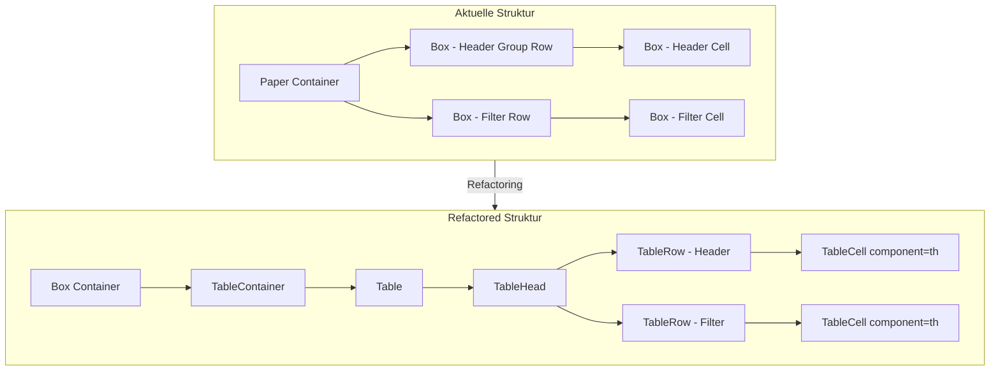

# Refactoring-Plan: JsonTableCollection Header

## Übersicht

Dieser Plan beschreibt das Refactoring der React-Komponente [`JsonTableCollection`](../src-widgets/src/JsonTableCollectionWidget/JsonTableCollection.tsx) mit Fokus auf den Table Header. Die Hauptziele sind:

1. **Paper-Komponente ersetzen**: Ersetzen durch MUI `Box` oder ein anderes neutrales Container-Element
2. **TanStack Table v8 Best Practices**: Anpassung der Header-Struktur an die empfohlene API-Nutzung
3. **Volle Funktionalität und Styling beibehalten**: Keine visuellen oder funktionalen Änderungen

---

## Analyse der aktuellen Implementierung

### Aktuelle Header-Struktur (Zeilen 755-976)

```tsx
<Paper
    elevation={noCard ? 0 : 6}
    sx={{
        position: 'sticky',
        top: 0,
        zIndex: 2,
        display: 'flex',
        flexDirection: 'column',
        minWidth: 'max-content',
        ...paperHeaderSx,
    }}
>
    {table.getHeaderGroups().map(headerGroup => (
        <Box key={headerGroup.id} sx={{ display: 'flex', flexDirection: 'row', ... }}>
            {headerGroup.headers.map(header => (
                <Box key={header.id} sx={{ width: getHeaderCellWidth(header), ... }}>
                    {/* Header Content */}
                </Box>
            ))}
        </Box>
    ))}
    {/* Filter Row */}
    {widget.data.tableFiltering === true && (
        <Box sx={{ display: 'flex', flexDirection: 'row' }}>
            {/* Filter Inputs */}
        </Box>
    )}
</Paper>
```

### Identifizierte Probleme

#### 1. Paper-Komponente
- **Problem**: `Paper` ist eine semantische MUI-Komponente mit eingebautem Elevation-Shadow
- **Auswirkung**: Unnötige semantische Bedeutung und visuelle Effekte (Schatten)
- **Lösung**: Ersetzen durch neutrale `Box`-Komponente

#### 2. Abweichung von TanStack Table v8 Best Practices
- **Problem**: Header-Zellen werden als `<Box>` statt als `<th>` gerendert
- **Problem**: Keine Verwendung von `<thead>` Container
- **Problem**: `colSpan` Attribut wird nicht verwendet (wichtig für gruppierte Header)
- **Auswirkung**:
  - Keine semantische HTML-Tabellenstruktur
  - Erschwerte Accessibility (Screenreader)
  - Inkompatibilität mit zukünftigen gruppierten Headern

### TanStack Table v8 Empfohlene Struktur

```tsx
<thead>
    {table.getHeaderGroups().map(headerGroup => (
        <tr key={headerGroup.id}>
            {headerGroup.headers.map(header => (
                <th key={header.id} colSpan={header.colSpan}>
                    {flexRender(header.column.columnDef.header, header.getContext())}
                </th>
            ))}
        </tr>
    ))}
</thead>
```

---

## Refactoring-Strategie

### Phase 1: Paper durch Box ersetzen

**Datei**: [`JsonTableCollection.tsx`](../src-widgets/src/JsonTableCollectionWidget/JsonTableCollection.tsx:755)

**Änderungen**:
1. Import von `Paper` entfernen (Zeile 17)
2. `Paper`-Komponente durch `Box` ersetzen (Zeile 755)
3. `elevation` Prop entfernen
4. Optional: `boxShadow` für visuelle Konsistenz bei Bedarf hinzufügen

**Vorher**:
```tsx
<Paper
    elevation={noCard ? 0 : 6}
    sx={{ ... }}
>
```

**Nachher**:
```tsx
<Box
    sx={{
        boxShadow: noCard ? 'none' : '0px 3px 5px -1px rgba(0,0,0,0.2), 0px 6px 10px 0px rgba(0,0,0,0.14), 0px 1px 18px 0px rgba(0,0,0,0.12)',
        ...restliche sx props
    }}
>
```

### Phase 2: Semantische Header-Struktur implementieren

**Herausforderung**: Die aktuelle Implementierung nutzt eine Sticky-Header-Technik mit `position: sticky` und Flexbox. Die TanStack-Empfehlung nutzt semantische `<thead>`/`<th>` Elemente.

**Lösung**: Hybrid-Ansatz - Beibehaltung der Sticky-Positionierung mit semantischen HTML-Elementen

**Struktur-Änderung**:

```tsx
{/* Sticky Header Container */}
<Box
    sx={{
        position: 'sticky',
        top: 0,
        zIndex: 2,
        ...paperHeaderSx,
    }}
>
    <TableContainer sx={{ overflow: 'visible' }}>
        <Table size={density === 'compact' ? 'small' : 'medium'}>
            <TableHead
                sx={{
                    display: 'table-header-group',
                    ...headerCellSx,
                }}
            >
                {table.getHeaderGroups().map(headerGroup => (
                    <TableRow key={headerGroup.id}>
                        {headerGroup.headers.map(header => {
                            const canSort = header.column.getCanSort();
                            const isSorted = header.column.getIsSorted();
                            const meta = header.column.columnDef.meta;
                            const isSelectCol = header.column.id === '__select__';

                            return (
                                <TableCell
                                    key={header.id}
                                    component="th"
                                    colSpan={header.colSpan}
                                    align={meta?.align || 'left'}
                                    sx={{
                                        width: getHeaderCellWidth(header),
                                        minWidth: isSelectCol ? 48 : 40,
                                        position: 'relative',
                                        ...headerCellSx,
                                    }}
                                >
                                    {/* Header Content */}
                                </TableCell>
                            );
                        })}
                    </TableRow>
                ))}
                {/* Filter Row als zusätzliche TableRow im thead */}
                {widget.data.tableFiltering === true && (
                    <TableRow>
                        {table.getHeaderGroups()[0]?.headers.map(header => (
                            <TableCell
                                key={header.id}
                                component="th"
                                colSpan={header.colSpan}
                                sx={{ py: 0.5, px: 0.5 }}
                            >
                                {/* Filter Input */}
                            </TableCell>
                        ))}
                    </TableRow>
                )}
            </TableHead>
        </Table>
    </TableContainer>
</Box>
```

### Phase 3: Import-Anpassungen

**Entfernen**:
```tsx
import { Paper } from '@mui/material';
```

**Hinzufügen** (falls nicht vorhanden):
```tsx
import { TableHead } from '@mui/material';
```

---

## Detaillierte Änderungsliste

### 1. Import-Bereich (Zeilen 11-29)

| Aktion | Komponente | Grund |
|--------|------------|-------|
| Entfernen | `Paper` | Wird durch `Box` ersetzt |
| Hinzufügen | `TableHead` | Für semantische Header-Struktur |

### 2. Header-Rendering (Zeilen 755-976)

| Bereich | Aktuell | Ziel |
|---------|---------|------|
| Container | `<Paper elevation={...}>` | `<Box sx={{ boxShadow: ... }}>` |
| Header Group | `<Box sx={{ display: 'flex' }}>` | `<TableRow>` |
| Header Cell | `<Box sx={{ width: ... }}>` | `<TableCell component="th" colSpan={header.colSpan}>` |
| Filter Row | `<Box sx={{ display: 'flex' }}>` | `<TableRow>` im `<TableHead>` |

### 3. Styling-Migration

**`paperHeaderSx`** (Zeilen 627-639):
```tsx
// Aktuell
const paperHeaderSx = useMemo(() => {
    if (noCard) {
        return { backgroundColor: 'transparent' };
    }
    const gradientBg = headerBgColor ? gradientColor(headerBgColor) : null;
    if (gradientBg) {
        return { background: gradientBg };
    }
    if (headerBgColor) {
        return { backgroundColor: headerBgColor };
    }
    return {};
}, [noCard, headerBgColor]);

// Nach Refactoring - gleiche Logik, anderer Name
const headerContainerSx = useMemo(() => {
    // Gleiche Implementierung
}, [noCard, headerBgColor]);
```

---

## Architektur-Diagramm



---

## Risiken und Überlegungen

### Risiko 1: Sticky-Header-Verhalten
- **Beschreibung**: Die Kombination von `position: sticky` mit `<thead>` kann in manchen Browsern Probleme verursachen
- **Minderung**: Ausführliches Browser-Testing (Chrome, Firefox, Safari, Edge)

### Risiko 2: Spaltenbreiten-Synchronisation
- **Beschreibung**: Header und Body müssen gleiche Spaltenbreiten haben
- **Minderung**: Beibehaltung der `getHeaderCellWidth`-Logik und `tableLayout`-Einstellungen

### Risiko 3: Resize-Handler
- **Beschreibung**: Die Resize-Handle-Positionierung muss mit `TableCell` funktionieren
- **Minderung**: `position: relative` auf TableCell sicherstellen

### Risiko 4: Filter-Row Positionierung
- **Beschreibung**: Filter-Inputs müssen korrekt unter den Header-Zellen ausgerichtet sein
- **Minderung**: Gleiche Width-Berechnung für Filter-Cells verwenden

---

## Validierungs-Checkliste

Nach dem Refactoring müssen folgende Punkte validiert werden:

- [ ] Header-Hintergrundfarbe wird korrekt angezeigt
- [ ] Header-Textfarbe wird korrekt angezeigt
- [ ] Header-Schriftgröße wird korrekt angewendet
- [ ] Sortierung funktioniert (Click und Menu)
- [ ] Filter-Inputs werden korrekt angezeigt
- [ ] Filter-Funktionalität funktioniert
- [ ] Column-Resize funktioniert
- [ ] Sticky-Header bleibt beim Scrollen oben
- [ ] Row-Selection Checkbox wird korrekt angezeigt
- [ ] Density-Einstellungen werden angewendet
- [ ] Responsive Verhalten ist korrekt
- [ ] Keine visuellen Regressionen

---

## Implementierungs-Reihenfolge

1. **Import-Anpassungen**: `Paper` entfernen, `TableHead` hinzufügen
2. **Container-Austausch**: `Paper` durch `Box` ersetzen
3. **Header-Struktur**: `<Box>` durch `<TableRow>` und `<TableCell>` ersetzen
4. **Filter-Row**: In `<TableHead>` als zusätzliche `<TableRow>` integrieren
5. **Styling-Validierung**: Alle visuellen Aspekte überprüfen
6. **Funktionalitäts-Test**: Sortierung, Filterung, Resize testen

---

## Datei-Referenzen

- Hauptdatei: [`src-widgets/src/JsonTableCollectionWidget/JsonTableCollection.tsx`](../src-widgets/src/JsonTableCollectionWidget/JsonTableCollection.tsx)
- Typen: [`src-widgets/src/JsonTableCollectionWidget/types.ts`](../src-widgets/src/JsonTableCollectionWidget/types.ts)
- Formatters: [`src-widgets/src/JsonTableCollectionWidget/utils/formatters.ts`](../src-widgets/src/JsonTableCollectionWidget/utils/formatters.ts)
