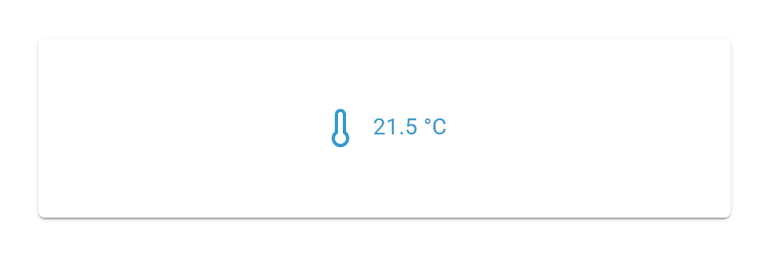

# Input Widget

## Beschreibung

Das Input Widget zeigt einen Text- oder Zahlenwert an, der an eine einzelne OID gebunden ist, und erlaubt die direkte Inline-Bearbeitung per Klick. Es akzeptiert die Datentypen string, number und mixed. Im Standardmodus wird jeder Tastenanschlag (verzögert) an die OID geschrieben; mit aktiviertem OK-Button wird der Wert erst beim Bestätigen übernommen.

## Einstellungshierarchie

Dieses Widget nutzt alle **vis-2 Einstellungen** und **Common Einstellungen**. Siehe [Home](De-Home.md) für Details.

Die Widget-spezifischen und Value-spezifischen Einstellungen überschreiben die allgemeineren Einstellungen.

## Widget-spezifische Einstellungen

### Objekt & Werte

| Feldname           | Typ      | Standard | Beschreibung                                                              | Bedingung                                              |
| ------------------ | -------- | -------- | ------------------------------------------------------------------------- | ------------------------------------------------------ |
| oid                | id       | -        | Object ID; akzeptiert die Typen string, number und mixed                  | -                                                      |
| unit               | text     | ''       | Einheit (wird aus dem Objekt übernommen, überschreibbar)                  | Nur wenn eine OID gewählt ist                          |
| ignoreCommonStates | checkbox | true     | Common States ignorieren (Werte-Gruppen aus `common.states` ausblenden)   | Nur wenn eine OID gewählt ist                          |
| values_count       | number   | 0        | Anzahl der Value-spezifischen Wertegruppen                                | Nur wenn Typ ≠ boolean und ignoreCommonStates = false  |

### Eingabe

| Feldname     | Typ      | Standard   | Beschreibung                                                                                | Bedingung |
| ------------ | -------- | ---------- | ------------------------------------------------------------------------------------------- | --------- |
| showOkButton | checkbox | false      | OK-Button anzeigen: Wert erst bei OK/Enter/Verlassen übernehmen (sonst jeder Tastenanschlag) | -         |
| inputVariant | select   | 'standard' | Variante des Textfelds (standard, outlined, filled)                                         | -         |
| inputPadding | number   | 1          | Innenabstand des Eingabefelds                                                               | -         |

### Zahlenbereich

Nur sichtbar, wenn die gebundene OID den Typ **number** hat.

| Feldname | Typ    | Standard | Beschreibung                                          | Bedingung  |
| -------- | ------ | -------- | ----------------------------------------------------- | ---------- |
| step     | number | 1        | Schrittweite                                          | Nur number |
| minValue | number | -        | Minimaler Wert (wird aus `common.min` vorausgefüllt)  | Nur number |
| maxValue | number | -        | Maximaler Wert (wird aus `common.max` vorausgefüllt)  | Nur number |

### Anzeige

| Feldname    | Typ      | Standard | Beschreibung                           | Bedingung           |
| ----------- | -------- | -------- | -------------------------------------- | ------------------- |
| onlyDisplay | checkbox | false    | Nur Anzeige (keine Inline-Bearbeitung) | Nur wenn write=true |
| noIcon      | checkbox | false    | Kein Icon anzeigen                     | -                   |
| noValue     | checkbox | false    | Keinen Wert anzeigen                   | -                   |

**Hinweis:** Zusätzlich zu den oben genannten Einstellungen sind die **Wert schreiben**-Einstellungen (Verzögerung/Intervall) verfügbar. Diese steuern, wie Wertänderungen an die OID geschrieben werden. Siehe [Common Einstellungen - Wert schreiben](De-Home.md#wert-schreiben) für Details.

## Datentypen

Das Input Widget unterstützt folgende Datentypen:

### String

- Textwerte, beliebige Zeichenketten
- Typische Anwendung: Statusmeldungen, Modi, Namen

### Number

- Numerische Werte mit optionalem Zahlenbereich (min/max/step)
- Einheit wird als Suffix im Feld angezeigt
- Typische Anwendung: Temperatur, Helligkeit, Prozentsätze

### Mixed

- Beliebige Werte (Text oder Zahl)
- Typische Anwendung: Universelle Eingabe

## Funktionsweise

### Display-first Inline-Bearbeitung

Das Widget zeigt den Wert (und wahlweise ein Icon) zentriert an. Ein Klick in die Anzeige wechselt inline in ein Textfeld:

- Das Icon wird während der Bearbeitung ausgeblendet
- Bei einer **number**-OID wird ein numerisches Eingabefeld mit step/min/max verwendet
- Die Einheit der OID wird als Suffix rechts im Feld angezeigt
- **Enter** oder ein Klick außerhalb beendet die Bearbeitung

### Schreibmodus

- **Ohne OK-Button** (Standard): Jeder Tastenanschlag wird an `useValueState` weitergereicht und verzögert (`delay`) an die OID geschrieben.
- **Mit OK-Button** (`showOkButton`): Ein lokaler Entwurf wird gehalten; der Wert wird erst beim Klick auf **OK**, bei **Enter** oder beim Verlassen des Felds übernommen.

### Nur-Lese-Modus

Wenn `onlyDisplay` aktiv ist oder die OID nicht beschreibbar ist (`write=false`), wechselt das Widget nie in den Bearbeitungsmodus und zeigt den Wert rein an.

### Konflikt-Anzeige

Wenn der Backend-Wert sich ändert, während der Benutzer bearbeitet (`hasBackendChange`), wird das Eingabefeld rot markiert (Fehler-Status).

## Value-spezifische Einstellungen

Wenn **values_count > 0** ist, können für jeden Wert individuelle Common-Einstellungen überschrieben werden (z. B. `icon1`, `backgroundColor1`, `textColor1` …). Dies entspricht dem Verhalten des [State Widgets](De-State-Widget.md#value-spezifische-einstellungen) und erlaubt z. B. eine eigene Hintergrundfarbe pro Zustandswert.

## Anwendungsbeispiele

- **Temperatur-Eingabe**: number-OID mit min/max/step und °C-Einheit
- **Status-Text ändern**: string-OID für Statusmeldungen oder Szenen-Namen
- **Lautstärke-Direkteingabe**: Zahl statt Slider, mit OK-Button gegen zu häufiges Schreiben
- **Universeller Wert**: mixed-OID für flexible Eingaben
