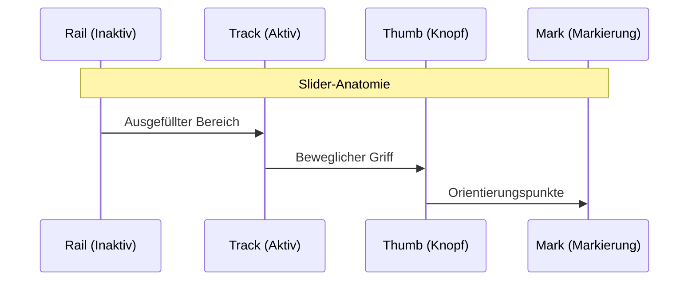

# Slider Widget

## Beschreibung

Das Slider Widget ist ein Schieberegler für numerische Werte mit umfangreichen Konfigurationsmöglichkeiten für Orientierung, Markierungen und Icons.

## Einstellungshierarchie

Dieses Widget nutzt alle **vis-2 Einstellungen** und **Common Einstellungen**. Siehe [Home](De-Home.md) für Details.

Die Widget-spezifischen Einstellungen überschreiben die allgemeineren Einstellungen.

## Widget-spezifische Einstellungen

### Grundeinstellungen

| Feldname          | Typ    | Standard     | Beschreibung                                | Bedingung                           |
| ----------------- | ------ | ------------ | ------------------------------------------- | ----------------------------------- |
| sliderSize        | select | 'medium'     | Größe des Schiebereglers (small, medium)    | -                                   |
| sliderOrientation | select | 'horizontal' | Ausrichtung des Schiebereglers              | -                                   |
| valueLabelDisplay | select | 'off'        | Anzeige des Wert-Labels (auto, on, off)     | -                                   |
| labelPosition     | text   | '-5px'       | Position des Labels (Pixel-Offset)          | Nur wenn valueLabelDisplay != 'off' |
| sliderColor       | color  | -            | Farbe des Schiebereglers (Gradient möglich) | -                                   |
| sliderPadding     | number | 1            | Innenabstand des Sliders                    | -                                   |
| sliderGap         | number | 0            | Abstand zwischen Slider-Komponenten (0-100) | -                                   |

### Wertebereich

| Feldname | Typ    | Standard | Beschreibung   | Bedingung |
| -------- | ------ | -------- | -------------- | --------- |
| minValue | number | 0        | Minimaler Wert | -         |
| maxValue | number | 100      | Maximaler Wert | -         |
| step     | number | 10       | Schrittweite   | -         |

### Markierungen

| Feldname        | Typ      | Standard | Beschreibung                             | Bedingung           |
| --------------- | -------- | -------- | ---------------------------------------- | ------------------- |
| marks           | checkbox | false    | Markierungen anzeigen                    | -                   |
| markPosition    | text     | '30px'   | Position der Markierungen (Pixel-Offset) | Nur wenn marks=true |
| markStep        | number   | -        | Schrittweite der Markierungen            | Nur wenn marks=true |
| markerTextColor | color    | -        | Textfarbe der Markierungen               | Nur wenn marks=true |
| markerTextSize  | slider   | -        | Textgröße der Markierungen               | Nur wenn marks=true |
| markerIconColor | color    | -        | Icon-Farbe der Markierungen              | Nur wenn marks=true |
| markerIconSize  | slider   | -        | Icon-Größe der Markierungen              | Nur wenn marks=true |

### Start-Icon (Min)

| Feldname       | Typ    | Standard | Beschreibung                 | Bedingung |
| -------------- | ------ | -------- | ---------------------------- | --------- |
| iconSmallMin   | icon64 | -        | Kleines Icon (SVG) am Anfang | -         |
| iconMin        | image  | -        | Großes Icon (Bild) am Anfang | -         |
| iconSizeStart  | slider | -        | Größe des Start-Icons        | -         |
| startIconColor | color  | -        | Farbe des Start-Icons        | -         |

### End-Icon (Max)

| Feldname     | Typ    | Standard | Beschreibung               | Bedingung |
| ------------ | ------ | -------- | -------------------------- | --------- |
| iconSmallMax | icon64 | -        | Kleines Icon (SVG) am Ende | -         |
| iconMax      | image  | -        | Großes Icon (Bild) am Ende | -         |
| iconSizeEnd  | slider | -        | Größe des End-Icons        | -         |
| endIconColor | color  | -        | Farbe des End-Icons        | -         |

### Erweiterte Styling-Optionen

Der Slider besteht aus mehreren Komponenten, die individuell gestylt werden können:

#### Thumb (Knopf)

| Feldname         | Typ    | Standard | Beschreibung                        | Bedingung |
| ---------------- | ------ | -------- | ----------------------------------- | --------- |
| thumbWidth       | number | 20       | Breite des Slider-Knopfs in Pixel   | -         |
| thumbHeight      | number | 20       | Höhe des Slider-Knopfs in Pixel     | -         |
| thumbColor       | color  | -        | Farbe des Knopfs (Gradient möglich) | -         |
| thumbBorderWidth | number | 0        | Rahmenbreite des Knopfs in Pixel    | -         |
| thumbBorderColor | color  | -        | Rahmenfarbe des Knopfs              | -         |

#### Track (Aktiver Bereich)

| Feldname             | Typ    | Standard | Beschreibung                                   | Bedingung |
| -------------------- | ------ | -------- | ---------------------------------------------- | --------- |
| trackLength          | number | 4        | Dicke des aktiven Bereichs in Pixel            | -         |
| trackBorderColor     | color  | -        | Rahmenfarbe des Tracks                         | -         |
| trackBackgroundColor | color  | -        | Hintergrundfarbe des Tracks (Gradient möglich) | -         |

#### Rail (Inaktiver Bereich)

| Feldname            | Typ    | Standard | Beschreibung                                  | Bedingung |
| ------------------- | ------ | -------- | --------------------------------------------- | --------- |
| railLength          | number | 4        | Dicke des inaktiven Bereichs in Pixel         | -         |
| railBackgroundColor | color  | -        | Hintergrundfarbe des Rails (Gradient möglich) | -         |

#### Mark (Markierungspunkte)

| Feldname            | Typ    | Standard | Beschreibung                                   | Bedingung |
| ------------------- | ------ | -------- | ---------------------------------------------- | --------- |
| markWidth           | number | 2        | Breite der Markierungspunkte in Pixel          | -         |
| markHeight          | number | 2        | Höhe der Markierungspunkte in Pixel            | -         |
| markBackgroundColor | color  | -        | Farbe der Markierungspunkte (Gradient möglich) | -         |

**Hinweis:** Zusätzlich zu den oben genannten Einstellungen sind die **Wert schreiben**-Einstellungen (Verzögerung/Intervall) verfügbar. Diese steuern, wie Wertänderungen an die OID geschrieben werden. Siehe [Common Einstellungen - Wert schreiben](De-Home.md#wert-schreiben) für Details.

## Terminologie

Der Slider besteht aus mehreren Komponenten:

- **Thumb**: Der bewegliche Knopf/Griff des Sliders, den der Benutzer verschiebt
- **Track**: Der aktive (ausgefüllte) Bereich des Sliders vom Minimum bis zur aktuellen Position
- **Rail**: Der inaktive (nicht ausgefüllte) Bereich des Sliders von der aktuellen Position bis zum Maximum
- **Mark**: Markierungspunkte auf dem Slider zur besseren Orientierung

### Gradient-Unterstützung

Die folgenden Slider-Felder unterstützen CSS-Gradienten zusätzlich zu einfachen Farben:
- `sliderColor`
- `thumbColor`
- `thumbBorderColor`
- `trackBackgroundColor`
- `trackBorderColor`
- `railBackgroundColor`
- `railBorderColor`
- `markBackgroundColor`
- `markerTextColor`

Siehe [Gradient-Syntax](De-Home.md#gradient-syntax) für Details. Beachten Sie, dass nur kreisförmige Radial-Gradienten unterstützt werden.

## Orientierung

### Horizontal

- Schieberegler von links nach rechts
- Standard-Ausrichtung
- Wert steigt nach rechts

### Vertikal

- Schieberegler von unten nach oben
- Platzsparend für schmale Layouts
- Wert steigt nach oben

## Markierungen

Markierungen helfen bei der Orientierung auf dem Schieberegler:

### Schrittweite

- `markStep` definiert den Abstand zwischen Markierungen
- Beispiel: Bei minValue=0, maxValue=100, markStep=10 werden Markierungen bei 0, 10, 20, ... 100 angezeigt

### Position

- **Top**: Markierungen oberhalb des Sliders
- **Bottom**: Markierungen unterhalb des Sliders
- **Both**: Markierungen auf beiden Seiten

### Styling

- Text und Icons an Markierungen können separat gestylt werden
- Farbe und Größe unabhängig einstellbar

## Min/Max Icons

Icons an den Enden des Schiebereglers visualisieren den Wertebereich:

### Start-Icon (Minimum)

- Wird am Anfang des Schiebereglers angezeigt (links bei horizontal, unten bei vertikal)
- Beispiel: Lautsprecher-Symbol für Lautstärke-Minimum

### End-Icon (Maximum)

- Wird am Ende des Schiebereglers angezeigt (rechts bei horizontal, oben bei vertikal)
- Beispiel: Lautsprecher-Symbol mit Schallwellen für Lautstärke-Maximum

## Diskrete Werte (onlyStates)

Die Einstellung `onlyStates` ist nur verfügbar, wenn mehrere Werte über `values_count` definiert wurden.

### Funktionsweise

Wenn `onlyStates` aktiviert ist:

- Der Slider zeigt nur die definierten Werte aus `values_count` an (diskrete Schritte)
- Der Benutzer kann nur zwischen diesen vordefinierten Werten wählen
- Zwischenwerte sind nicht möglich

### Beispiel

Bei `values_count=3` mit Werten `[0, 50, 100]`:

- **onlyStates=false**: Slider kann jeden Wert zwischen 0 und 100 annehmen (kontinuierlich)
- **onlyStates=true**: Slider kann nur die Werte 0, 50 oder 100 annehmen (diskret)

### Anwendungsfälle

- **Lüfterstufen**: Aus (0), Niedrig (1), Mittel (2), Hoch (3)
- **Helligkeitsstufen**: 0%, 25%, 50%, 75%, 100%
- **Voreinstellungen**: Vordefinierte Temperaturwerte

## Anwendungsbeispiele

- **Lautstärkeregler**: Min-Icon = leiser Lautsprecher, Max-Icon = lauter Lautsprecher
- **Helligkeitsregler**: Min-Icon = Mond, Max-Icon = Sonne
- **Temperatur**: Min-Icon = Schneeflocke, Max-Icon = Flamme
- **Jalousie**: Vertikal, Min = geschlossen, Max = offen
