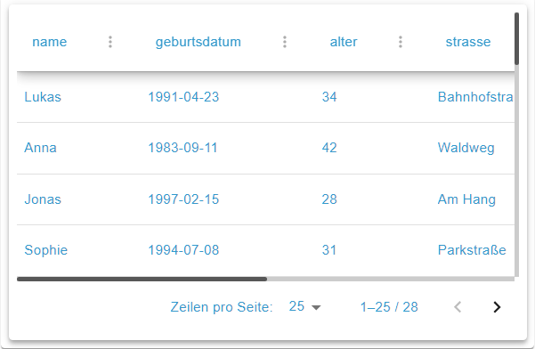

# JSON Table Widget



## Description

The JSON Table Widget displays tabular data from a JSON-valued ioBroker state object. It uses TanStack Table v8 (headless) for powerful features like sorting, filtering, pagination, and column customization. Columns are auto-discovered from the JSON structure and can be extensively configured through the visual column editor.

## Settings Hierarchy

This widget uses all **vis-2 Settings** and **Common Settings**. See [Home](En-Home.md) for details.

The widget-specific settings override the more general settings.

## Data Source

| Field Name | Type   | Default | Description                                          | Condition |
| ---------- | ------ | ------- | ---------------------------------------------------- | --------- |
| oid        | id     | -       | OID for JSON data (type: string, mixed, or json)     | -         |

The JSON data can be:
- **Array of objects**: Each object represents a row
- **Nested objects**: Flattened automatically with configurable depth
- **JSON string**: Parsed automatically

## Column Configuration

### Column Editor

| Field Name   | Type   | Default | Description                            | Condition |
| ------------ | ------ | ------- | -------------------------------------- | --------- |
| columnConfig | custom | -       | Visual column configuration editor     | -         |

The column editor provides:
- **Drag & drop reordering**: Rearrange columns by dragging
- **Visibility toggle**: Show/hide individual columns
- **Column settings**: Configure label, width, alignment, format
- **Conditional styling**: Apply styles based on cell values
- **Data type detection**: Automatic detection of the data type (`string`, `number`, `boolean`, `date`, `image`, `array`, `object`, `null`, `mixed`). The **detected type** is a hint and drives the default **format type** — but it may be chosen freely.

### Column Properties

Each column can be configured with:

| Property     | Description                                          |
| ------------ | ---------------------------------------------------- |
| id           | Unique column identifier (auto-generated from JSON)  |
| label        | Display name in header                               |
| width        | Column width (px, %, or auto)                        |
| minWidth     | Minimum column width                                 |
| maxWidth     | Maximum column width                                 |
| align        | Text alignment (left, center, right)                 |
| visible      | Show/hide column                                     |
| sortable     | Sorting for this column — `true` / `false` / `'auto'` |
| filterable   | Filtering for this column — `true` / `false` / `'auto'` |
| enableHiding | Column can be hidden via the column menu — `true` / `false` / `'auto'` |

> **Smart defaults (`'auto'`):** In `'auto'` mode (the default), sortability and filterability are derived from the **detected type**: `number`/`date` → sortable and filterable, `boolean` → filterable only, `image`/`array`/`object` → neither. `enableHiding: 'auto'` follows the global `tableHiding` setting.

### Column Formatting

Each column has exactly one active **format type** that determines how the raw value is rendered. It is pre-set from the detected type but can be chosen freely.

| Format Type | Description                                          | Key Options                                           |
| ----------- | ---------------------------------------------------- | ---------------------------------------------------- |
| String      | Text display, including HTML rendering               | case, prefix, suffix, trim, maxLength, regex, font style |
| Number      | Numeric formatting with thousands separator          | decimals, prefix, suffix, thousandsSeparator         |
| Boolean     | Boolean as text                                     | trueText, falseText                                  |
| Date        | Date/time formatting                                 | format string (predefined), detected input format    |
| Image       | Render the raw value as an image/icon graphic        | size, objectFit, variant, tint, padding, …           |

See the subsections below for the format-type-specific options.

### String Formatting

| Property    | Description                                                            |
| ----------- | --------------------------------------------------------------------- |
| trim        | Remove leading/trailing whitespace (before all other steps)            |
| regex       | Extract a regex sub-match (additional options: regexGroup, regexFlags) |
| regexGroup  | Capture group to use (0 = full match)                                 |
| case        | none / upper / lower / title                                          |
| maxLength   | Truncate to N characters (appends "…")                                |
| prefix/suffix | Prepend/append to the value                                          |
| fontWeight/fontStyle/fontSize/textColor | Static font settings (overridable by conditional rules) |

> **Note — HTML rendering:** String cells render HTML markup (e.g. `<b>`, `<br>`, `<span style="…">`). The values come from your own ioBroker state and are treated as trusted. If you bind third-party data, be aware of the XSS risk of unfiltered HTML.

### Image Column (format type `image`)

An **image column** renders every raw value as a graphic instead of text. The raw value is read as a **visual reference** — never as an icon *name* (`mdi-*`, `fa-*`); there is no name resolution. Supported:

- **URL or file path** (image or SVG)
- **`data:image/…` URI**
- **UTF-8 character** (e.g. an emoji)

**Icon vs image** is a value-level, runtime distinction — not a separate column type: an *icon* is a small monochrome glyph (SVG data URI or UTF-8 character), an *image* is a raster photo (png/jpg/webp/…). A configured colour **tint** applies to either via a CSS mask (the source's alpha channel) — exact for monochrome icons.

| Property                 | Default   | Description                                                 |
| ------------------------ | --------- | ----------------------------------------------------------- |
| size                     | 64        | Render size in px (8–256)                                   |
| objectFit                | contain   | contain / cover / fill (CSS `object-fit`)                   |
| variant                  | square    | square / rounded / circular (avatar shape)                  |
| bgColor                  | –         | Avatar background colour                                    |
| borderColor / borderWidth | – / –    | Avatar border (only with a colour and width > 0)            |
| tint                     | –         | Colour tint via CSS mask                                    |
| tooltip                  | true      | Show raw value as a hover tooltip                           |
| showBroken               | true      | Show a placeholder icon when a URL fails to load            |
| padding (top/right/bottom/left) | 0 8 0 8 | Per-side inner padding in px (0–64)                  |

**Auto-detection:** Columns whose values are URLs, data URIs, or glyphs are detected as type `image` and rendered as graphics immediately — without manual configuration.

**Fallback:** If a value cannot be resolved to a graphic, it is rendered as text. An empty value shows an empty cell, a broken URL shows the placeholder. The graphic is rendered XSS-safe (never via `innerHTML`).

### Conditional Styling

Apply dynamic styles based on cell values:
- **Conditions**: Compare against fixed values or thresholds (json-logic rules)
- **Styles**: Background color, text color, font weight, font style
- **Evaluation mode** (`cellStyleMode`):

| Mode           | Description                                                                  |
| -------------- | ---------------------------------------------------------------------------- |
| `first-match` (default) | Stops at the first matching rule.                                   |
| `all-match`    | All matching rules are applied; on conflicts the higher-priority rule (lower index) wins. |

- **Visual preview**: See effective result immediately

## Features

> **Persistence:** The current table view — sorting, active filters, and column visibility — is preserved across page reloads (stored locally per browser).

### Sorting

| Field Name       | Type     | Default | Description                           | Condition |
| ---------------- | -------- | ------- | ------------------------------------- | --------- |
| tableSorting     | checkbox | true    | Enable column sorting                 | -         |
| tableSortingMulti| checkbox | false   | Enable multi-column sorting (Ctrl+Click) | -      |

### Filtering

| Field Name      | Type     | Default | Description                           | Condition |
| --------------- | -------- | ------- | ------------------------------------- | --------- |
| tableFiltering  | checkbox | true    | Enable column filtering               | -         |
| tableQuickFilter| checkbox | false   | Show global search field              | -         |
| tableColumnMenu | checkbox | true    | Show column menu (filter/sort/hide)   | -         |
| tableHiding     | checkbox | true    | Allow hiding columns via menu         | -         |

### Pagination

| Field Name              | Type     | Default   | Description                           | Condition |
| ----------------------- | -------- | --------- | ------------------------------------- | --------- |
| tablePagination         | checkbox | true      | Enable pagination                     | -         |
| tablePageSize           | number   | 25        | Initial page size                     | Pagination enabled |
| tablePageSizeOptions    | text     | '10,25,50,100' | Available page sizes (comma-separated) | Pagination enabled |
| tableVirtualizeThreshold| number   | 50        | Row count threshold for virtualization | -         |

### Row Selection

| Field Name         | Type     | Default | Description                           | Condition |
| ------------------ | -------- | ------- | ------------------------------------- | --------- |
| tableRowSelection  | checkbox | false   | Enable row selection (checkboxes)      | -         |

### Analysis Options

| Field Name     | Type   | Default | Description                           | Condition |
| -------------- | ------ | ------- | ------------------------------------- | --------- |
| tableMaxDepth  | number | 10      | Maximum nesting depth for JSON flattening | -    |

## Layout

### Table Layout

| Field Name         | Type     | Default     | Description                           | Condition |
| ------------------ | -------- | ----------- | ------------------------------------- | --------- |
| tableDensity       | select   | 'standard'  | Row density (compact, standard, comfortable) | -   |
| tableRowHeight     | number   | -           | Fixed row height (px)                 | -         |
| tableHeaderHeight  | number   | -           | Header height (px)                    | -         |
| tableAutoSize      | checkbox | false       | Auto-size columns to fit container    | -         |
| tableHeaderElevation| slider  | 6           | Header shadow elevation (0-24)        | -         |
| jsonTablePadding   | number   | 1           | Inner padding                         | -         |

### Table Border

| Field Name   | Type   | Default | Description                           | Condition |
| ------------ | ------ | ------- | ------------------------------------- | --------- |
| borderWidth  | slider | 0       | Outer border width (0-20)             | -         |
| borderStyle  | select | 'solid' | Border style (none, solid, dashed, etc.) | -      |
| borderColor  | color  | -       | Border color                          | -         |
| borderRadius | text   | -       | Border radius (CSS value)             | -         |

### Header Styling

| Field Name            | Type   | Default | Description                           | Condition |
| --------------------- | ------ | ------- | ------------------------------------- | --------- |
| tableHeaderBgColor    | color  | -       | Header background color               | -         |
| tableHeaderTextColor  | color  | -       | Header text color                     | -         |
| tableHeaderFontSize   | number | -       | Header font size (px)                 | -         |
| headerBorderWidth     | slider | 0       | Header bottom border width (0-10)     | -         |
| headerBorderColor     | color  | -       | Header border color                   | -         |

### Cell Borders

| Field Name                | Type     | Default | Description                           | Condition                    |
| ------------------------- | -------- | ------- | ------------------------------------- | ---------------------------- |
| tableShowCellBorders      | checkbox | false   | Show vertical cell borders            | -                            |
| verticalCellBorderWidth   | slider   | 1       | Vertical border width (0-10)          | Cell borders enabled         |
| verticalCellBorderColor   | color    | -       | Vertical border color                 | Cell borders enabled         |
| tableShowRowBorders       | checkbox | true    | Show horizontal row borders           | -                            |
| horizontalCellBorderWidth | slider   | 1       | Horizontal border width (0-10)        | Row borders enabled          |
| horizontalCellBorderColor | color    | -       | Horizontal border color               | Row borders enabled          |

### Cell Styling

| Field Name         | Type   | Default | Description                           | Condition |
| ------------------ | ------ | ------- | ------------------------------------- | --------- |
| evenRowColor       | color  | -       | Background color for even rows        | -         |
| oddRowColor        | color  | -       | Background color for odd rows         | -         |

> Note: The per-column font size is set via the **String** format type (`fontSize`) or conditional styling; there is no separate table-level field for the cell font size.

## JSON Data Formats

### Simple Array

```json
[
  {"name": "John", "age": 30, "city": "New York"},
  {"name": "Jane", "age": 25, "city": "London"}
]
```

### Nested Objects

```json
[
  {
    "user": {"name": "John", "email": "john@example.com"},
    "stats": {"logins": 42, "lastLogin": "2024-01-15"}
  }
]
```

Nested paths are flattened to `user.name`, `stats.logins`, etc.

### Array Values

```json
[
  {"id": 1, "tags": ["urgent", "work"]},
  {"id": 2, "tags": ["personal"]}
]
```

Arrays are displayed as comma-separated values or can be expanded.

### Images & Icons

Columns with image references are detected as type `image` and rendered as graphics automatically:

```json
[
  {"name": "Lamp",   "icon": "💡"},
  {"name": "Sensor", "icon": "🌡️"},
  {"name": "Camera", "image": "https://example.com/cam1.png"},
  {"name": "Logo",   "image": "data:image/svg+xml,%3Csvg …%3E"}
]
```

URLs, `data:image/…` URIs, and UTF-8 characters are all recognised (see [Image Column](#image-column-format-type-image)).

## Use Cases

### Device List

```
oid: javascript.0.deviceList
tableSorting: true
tableFiltering: true
tableQuickFilter: true
tablePagination: true
tablePageSize: 25
```

JSON structure:
```json
[
  {"device": "Living Room Light", "type": "bulb", "state": "on", "battery": 100},
  {"device": "Kitchen Sensor", "type": "motion", "state": "idle", "battery": 85}
]
```

### Log Table

```
oid: javascript.0.logs
tableSorting: true
tableSortingMulti: true
tableFiltering: true
tablePagination: true
tablePageSize: 50
tableDensity: compact
```

### Status Dashboard

```
oid: javascript.0.statusData
tableAutoSize: true
tablePagination: false
tableShowRowBorders: true
evenRowColor: #f5f5f5
```

### Conditional Formatting Example

Configure columns to show:
- Green background for battery > 80%
- Yellow background for battery 50-80%
- Red background for battery < 50%

This is done through the column editor's conditional styling feature.

## Performance Tips

1. **Virtualization**: Automatically enabled for tables with more than `tableVirtualizeThreshold` rows
2. **Pagination**: Use for large datasets to improve render performance
3. **Max Depth**: Lower `tableMaxDepth` for deeply nested JSON to reduce processing time
4. **Column Visibility**: Hide unnecessary columns to reduce DOM elements

## Integration with ioBroker

### Creating JSON Data

Use a JavaScript adapter script to generate JSON data:

```javascript
// Example: Aggregate device data into JSON
const devices = $('channel[state.id=*.state]');
const tableData = devices.map(id => ({
  name: getObject(id).common.name,
  state: getState(id).val,
  lastUpdate: new Date(getState(id).ts).toISOString()
}));
setState('javascript.0.deviceTable', JSON.stringify(tableData), true);
```

### Reacting to Row Selection

Bind `tableRowSelection` to a state and process selected rows in your logic.
