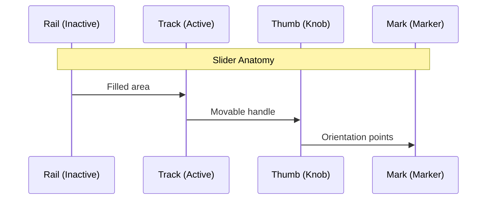

# Slider Widget

## Description

The Slider Widget is a slider for numeric values with extensive configuration options for orientation, marks, and icons.

## Settings Hierarchy

This widget uses all **vis-2 Settings** and **Common Settings**. See [Home](En-Home.md) for details.

The widget-specific settings override the more general settings.

## Widget-Specific Settings

### Basic Settings

| Field Name        | Type   | Default      | Description                             | Condition                            |
| ----------------- | ------ | ------------ | --------------------------------------- | ------------------------------------ |
| sliderSize        | select | 'medium'     | Size of the slider (small, medium)      | -                                    |
| sliderOrientation | select | 'horizontal' | Orientation of the slider               | -                                    |
| valueLabelDisplay | select | 'off'        | Display of value label (auto, on, off)  | -                                    |
| labelPosition     | text   | '-5px'       | Position of the label (pixel offset)    | Only when valueLabelDisplay != 'off' |
| sliderColor       | color  | -            | Color of the slider (gradient possible) | -                                    |
| sliderPadding     | number | 1            | Inner padding of the slider             | -                                    |
| sliderGap         | number | 0            | Gap between slider components (0-100)   | -                                    |

### Value Range

| Field Name | Type   | Default | Description   | Condition |
| ---------- | ------ | ------- | ------------- | --------- |
| minValue   | number | 0       | Minimum value | -         |
| maxValue   | number | 100     | Maximum value | -         |
| step       | number | 10      | Step size     | -         |

### Marks

| Field Name      | Type     | Default | Description                      | Condition            |
| --------------- | -------- | ------- | -------------------------------- | -------------------- |
| marks           | checkbox | false   | Show marks                       | -                    |
| markPosition    | text     | '30px'  | Position of marks (pixel offset) | Only when marks=true |
| markStep        | number   | 10      | Step size of marks               | Only when marks=true |
| markerTextColor | color    | -       | Text color of marks              | Only when marks=true |
| markerTextSize  | slider   | -       | Text size of marks               | Only when marks=true |
| markerIconColor | color    | -       | Icon color of marks              | Only when marks=true |
| markerIconSize  | slider   | -       | Icon size of marks               | Only when marks=true |

### Start Icon (Min)

| Field Name     | Type   | Default | Description                 | Condition |
| -------------- | ------ | ------- | --------------------------- | --------- |
| iconSmallMin   | icon64 | -       | Small icon (SVG) at start   | -         |
| iconMin        | image  | -       | Large icon (image) at start | -         |
| iconSizeStart  | text   | '24px'  | Size of start icon          | -         |
| startIconColor | color  | -       | Color of start icon         | -         |

### End Icon (Max)

| Field Name   | Type   | Default | Description               | Condition |
| ------------ | ------ | ------- | ------------------------- | --------- |
| iconSmallMax | icon64 | -       | Small icon (SVG) at end   | -         |
| iconMax      | image  | -       | Large icon (image) at end | -         |
| iconSizeEnd  | text   | '24px'  | Size of end icon          | -         |
| endIconColor | color  | -       | Color of end icon         | -         |

### Advanced Styling Options

The slider consists of multiple components that can be styled individually:

#### Thumb (Knob)

| Field Name       | Type   | Default | Description                           | Condition |
| ---------------- | ------ | ------- | ------------------------------------- | --------- |
| thumbWidth       | number | 20      | Width of the slider knob in pixels    | -         |
| thumbHeight      | number | 20      | Height of the slider knob in pixels   | -         |
| thumbColor       | color  | -       | Color of the knob (gradient possible) | -         |
| thumbBorderWidth | number | 0       | Border width of the knob in pixels    | -         |
| thumbBorderColor | color  | -       | Border color of the knob              | -         |

#### Track (Active Area)

| Field Name           | Type   | Default | Description                                       | Condition |
| -------------------- | ------ | ------- | ------------------------------------------------- | --------- |
| trackLength          | number | 4       | Thickness of the active area in pixels            | -         |
| trackBorderColor     | color  | -       | Border color of the track                         | -         |
| trackBackgroundColor | color  | -       | Background color of the track (gradient possible) | -         |

#### Rail (Inactive Area)

| Field Name          | Type   | Default | Description                                      | Condition |
| ------------------- | ------ | ------- | ------------------------------------------------ | --------- |
| railLength          | number | 4       | Thickness of the inactive area in pixels         | -         |
| railBackgroundColor | color  | -       | Background color of the rail (gradient possible) | -         |

#### Mark (Marker Points)

| Field Name          | Type   | Default | Description                                    | Condition |
| ------------------- | ------ | ------- | ---------------------------------------------- | --------- |
| markWidth           | number | 2       | Width of the marker points in pixels           | -         |
| markHeight          | number | 2       | Height of the marker points in pixels          | -         |
| markBackgroundColor | color  | -       | Color of the marker points (gradient possible) | -         |

**Note:** In addition to the settings above, the **Write Value** settings (delay/interval) are available. These control how value changes are written to the OID. See [Common Settings - Write Value](En-Home.md#write-value) for details.

## Terminology

The slider consists of multiple components:

- **Thumb**: The movable knob/handle of the slider that the user moves
- **Track**: The active (filled) area of the slider from minimum to current position
- **Rail**: The inactive (unfilled) area of the slider from current position to maximum
- **Mark**: Marker points on the slider for better orientation

### Gradient Support

The following slider fields support CSS gradients in addition to solid colors:
- `sliderColor`
- `thumbColor`
- `thumbBorderColor`
- `trackBackgroundColor`
- `trackBorderColor`
- `railBackgroundColor`
- `railBorderColor`
- `markBackgroundColor`
- `markerTextColor`

See [Gradient Syntax](En-Home.md#gradient-syntax) for details. Note that only circular radial gradients are supported.

## Orientation

### Horizontal

- Slider from left to right
- Default orientation
- Value increases to the right

### Vertical

- Slider from bottom to top
- Space-saving for narrow layouts
- Value increases upward

## Marks

Marks help with orientation on the slider:

### Step Size

- `markStep` defines the distance between marks
- Example: With minValue=0, maxValue=100, markStep=10, marks are displayed at 0, 10, 20, ... 100

### Position

- **Top**: Marks above the slider
- **Bottom**: Marks below the slider
- **Both**: Marks on both sides

### Styling

- Text and icons at marks can be styled separately
- Color and size independently adjustable

## Min/Max Icons

Icons at the ends of the slider visualize the value range:

### Start Icon (Minimum)

- Displayed at the start of the slider (left for horizontal, bottom for vertical)
- Example: Speaker icon for volume minimum

### End Icon (Maximum)

- Displayed at the end of the slider (right for horizontal, top for vertical)
- Example: Speaker icon with sound waves for volume maximum

## Discrete Values (onlyStates)

The `onlyStates` setting is only available when multiple values are defined via `values_count`.

### Functionality

When `onlyStates` is enabled:

- The slider only displays the defined values from `values_count` (discrete steps)
- The user can only choose between these predefined values
- Intermediate values are not possible

### Example

With `values_count=3` and values `[0, 50, 100]`:

- **onlyStates=false**: Slider can take any value between 0 and 100 (continuous)
- **onlyStates=true**: Slider can only take the values 0, 50, or 100 (discrete)

### Use Cases

- **Fan speeds**: Off (0), Low (1), Medium (2), High (3)
- **Brightness levels**: 0%, 25%, 50%, 75%, 100%
- **Presets**: Predefined temperature values

## Use Cases

- **Volume Control**: Min-Icon = quiet speaker, Max-Icon = loud speaker
- **Brightness Control**: Min-Icon = moon, Max-Icon = sun
- **Temperature**: Min-Icon = snowflake, Max-Icon = flame
- **Blinds**: Vertical, Min = closed, Max = open
