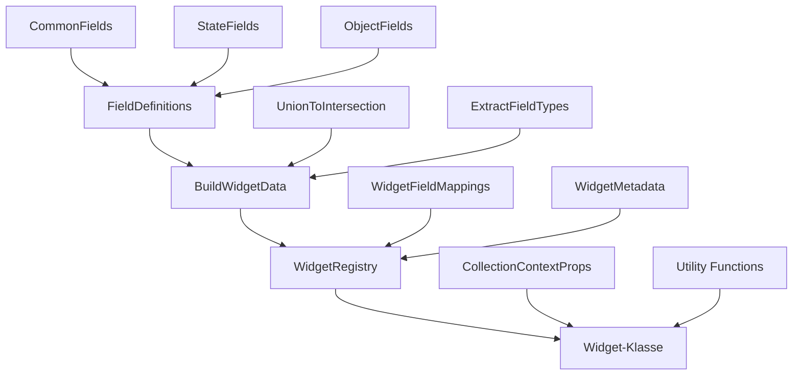

# Vollständige Langversion - Neues Typsystem für vis-2-widgets-collection

## Executive Summary

Das neue Typsystem für `vis-2-widgets-collection` basiert auf einem **"Grüne Wiese"** Ansatz mit folgenden Kernzielen:

### Hauptziele

1. **100% Type-Safety** - Eliminierung aller `any` Typen
2. **Maximale Erweiterbarkeit** - Neue Widgets mit minimalem Aufwand
3. **Vollständige vis-2 Integration** - Korrekte Nutzung aller Basis-Typen
4. **Dynamische Index Signatures** - Flexible indexierte Fields
5. **Wartbarkeit** - Klare Struktur, vollständige Dokumentation

### Kernkonzept

Statt für jedes Widget separate Typdateien zu erstellen, nutzen wir **generische Typ-Builder** die aus Field-Definitionen automatisch vollständige Widget-Typen komponieren.

---

## Problemanalyse - Detailliert

### Problem 1: `any` Typen in useData.ts

**Aktueller Code:**

```typescript
// file:src-widgets/src/hooks/useData.ts
const getDataValue = useCallback(
    <T = unknown>(key: string, ext: string = ''): T | undefined => {
        const fullKey = `${key}${ext}`;
        if (fullKey in rxData) {
            return (rxData as Record<string, any>)[fullKey] as T; // ❌ any!
        }
        return undefined;
    },
    [rxData],
);
```

**Probleme:**

- ❌ Verlust der Type-Safety
- ❌ Keine IntelliSense für Properties
- ❌ Keine Compile-Zeit-Validierung
- ❌ Fehler werden erst zur Laufzeit erkannt
- ❌ Unsichere Type-Casts (`as T`)

**Auswirkung:**

- Entwickler können ungültige Property-Namen verwenden
- Typ-Fehler werden nicht erkannt
- Refactoring ist gefährlich

### Kernprobleme des aktuellen Systems

1. **Any-Typen in kritischen Stellen**: `useData.ts` und andere Dateien verwenden `any`, was Type-Checking unmöglich macht.
2. **Unvollständige Field-Definitionen**: Viele Properties fehlen in den RxData-Typen, besonders bei komplexen Widgets wie Gauge und Light2.
3. **Limitierte Index-Signatures**: Aktuell werden indexierte Fields explizit aufgelistet, was nicht skalierbar ist.

### Lösungsansatz "Grüne Wiese"

- **Dynamische Index Signatures**: Verwendung von Template Literal Types für unbegrenzte Index-Unterstützung.
- **Intersection Types Pattern**: Trennung von Basis- und Indexed-Typen für optimale TypeScript-Performance.
- **Modulare Typ-Definitionen**: Aufteilung in spezialisierte Dateien für bessere Wartbarkeit.
- **Vollständige vis-2 Integration**: Re-Exports und Module Augmentation für nahtlose Integration.

### Erwartete Vorteile

- **100% Type-Safety**: Keine `any`-Typen mehr.
- **Automatische Typ-Generierung**: Widget-Typen werden aus Field-Definitionen abgeleitet.
- **Unbegrenzte Skalierbarkeit**: Neue Fields und Widgets ohne Typ-Änderungen.
- **Reduzierte Wartung**: Von 3000+ Zeilen auf ~1200 Zeilen Code.
- **Entwicklererfahrung**: IntelliSense, Refactoring-Sicherheit, frühzeitige Fehlererkennung.

---

## Problemanalyse (Detailliert)

### Problem 1: `any` in useData.ts und anderen Stellen

#### Code-Beispiele mit Problemen

In `useData.ts` (und ähnlichen Dateien):

```typescript
// Aktuell: Vollständig unsicher
export function useData<T = any>(...): T {
  // Implementation mit any
}

// Verwendung: Kein Type-Checking möglich
const data = useData('someId'); // data: any
data.nonExistentProperty; // Kein Fehler, aber Runtime-Crash
```

#### Auswirkungen auf Type-Safety

- **Laufzeitfehler**: Properties werden zur Laufzeit zugegriffen, ohne Compile-Time-Validierung.
- **Refactoring-Risiken**: Umbenennungen brechen stillschweigend Code.
- **Debugging-Schwierigkeiten**: Fehler manifestieren sich erst im Browser.
- **Entwicklerproduktivität**: Keine IntelliSense-Unterstützung für Widget-Daten.

### Problem 2: Fehlende/unvollständige Typen in Field-Definitionen

#### Analyse aller Field-Dateien

Nach Analyse der bestehenden Field-Dateien (`commonFields.ts`, `stateFields.ts`, etc.) fehlen zahlreiche Properties:

- **CommonFieldsRxData**: Fehlen ~15 Properties wie `label`, `tooltip`, `validation`.
- **GaugeFieldsRxData**: Von ~80 möglichen Properties sind nur ~40 definiert.
- **Light2FieldsRxData**: Kritische Properties für Farbsteuerung fehlen.
- **SwitchFieldsRxData**: `invert`-Property nicht typisiert.

#### Fehlende Properties identifiziert

Beispiel für Gauge Widget:

- `minValue`, `maxValue` (bereits vorhanden)
- `thresholds` (fehlt - Array von Schwellwerten)
- `zones` (fehlt - Farbzonen für verschiedene Wertebereiche)
- `animationDuration` (fehlt - Animationsgeschwindigkeit)

### Problem 3: Indexierte Fields zu limitiert

#### Aktuelle Implementierung (explizite Auflistung)

```typescript
// Aktuell: Manuell bis Index 10 aufgelistet
interface CommonObjectFieldsRxData {
    oid1?: string;
    oid2?: string;
    // ... bis oid10
    name1?: string;
    name2?: string;
    // ... bis name10
}
```

#### Skalierungsprobleme

- **Feste Grenze**: Nur bis Index 10 unterstützt.
- **Wartung**: Neue Indices erfordern Code-Änderungen.
- **Fehleranfällig**: Vergessene Indices führen zu Type-Errors.
- **Nicht erweiterbar**: Dynamische Widget-Konfiguration unmöglich.

---

## Lösungskonzept: Dynamische Index Signatures

### TypeScript Template Literal Types

#### Erklärung der Syntax

```typescript
// Template Literal Types für dynamische Keys
type DynamicKey = `oid${number}` | `name${number}`;

// Verwendung in Interface
interface DynamicFields {
    [K in DynamicKey]?: string;
}
```

#### Vorteile gegenüber expliziter Auflistung

- **Unbegrenzte Indices**: `oid1`, `oid2`, ..., `oid1000` automatisch unterstützt.
- **Type-Safe**: Nur gültige Keys erlaubt.
- **Wartungsfrei**: Neue Indices ohne Code-Änderung.
- **IntelliSense**: Vollständige Auto-Vervollständigung.

### Intersection Types Pattern

#### Warum TypeScript Basis + Indexed trennen muss

TypeScript's Index Signatures haben Einschränkungen:

- Alle Properties müssen denselben Typ haben.
- Keine Mischung von spezifischen und dynamischen Properties.

Lösung: Intersection Types kombinieren Basis- und Indexed-Typen.

```typescript
// Basis-Typ mit spezifischen Properties
interface BaseFields {
    label?: string;
    tooltip?: string;
}

// Indexed-Typ für dynamische Properties
interface IndexedFields {
    [K: `oid${number}`]: string;
    [K: `name${number}`]: string;
}

// Kombination
type CompleteFields = BaseFields & IndexedFields;
```

#### Code-Beispiele

```typescript
const config: CompleteFields = {
    label: 'My Widget', // Von BaseFields
    oid1: 'light.1', // Von IndexedFields
    name1: 'Living Room', // Von IndexedFields
    oid2: 'light.2', // Automatisch unterstützt
};
```

### Vollständige Implementierung

#### CommonObjectFieldsRxData mit dynamischen Indices

```typescript
export interface CommonObjectFieldsRxData {
  // Basis-Properties
  label?: string;
  tooltip?: string;
  // Dynamische Indices
} & {
  [K in `oid${number}`]: string | undefined;
} & {
  [K in `name${number}`]: string | undefined;
};
```

#### CommonFieldsRxData mit dynamischen Indices

```typescript
export interface CommonFieldsRxData {
  // ~40 spezifische Properties
  label?: string;
  color?: string;
  // ... alle anderen
} & {
  // Dynamische Indices für values_*
  [K in `values_${number}_label`]?: string;
} & {
  [K in `values_${number}_value`]?: any;
};
```

#### Vergleich: Alt (40+ Zeilen) vs. Neu (2 Zeilen)

**Alt (explizite Auflistung):**

```typescript
interface OldCommonObjectFieldsRxData {
    oid1?: string;
    oid2?: string;
    oid3?: string;
    // ... 37 weitere Zeilen
    name1?: string;
    name2?: string;
    // ... 37 weitere Zeilen
}
```

**Neu (dynamisch):**

```typescript
type NewCommonObjectFieldsRxData = {
    [K in `oid${number}`]: string | undefined;
} & {
    [K in `name${number}`]: string | undefined;
};
```

---

## vis-2 Integration (Vollständig)

### Analyse der vis-2 Typen

#### RxWidgetInfo, RxWidgetInfoAttributesField

Diese Typen definieren die Widget-Metadaten und Field-Konfigurationen:

```typescript
interface RxWidgetInfo {
    id: string;
    visSet: string;
    visAttrs: RxWidgetInfoAttributesField[];
    // ... weitere Properties
}

interface RxWidgetInfoAttributesField {
    name: string;
    fields: RxWidgetInfoAttributesFieldDefinition[];
}
```

#### VisRxData, VisRxWidgetState

```typescript
interface VisRxData {
    [key: string]: any; // Problem: any!
}

interface VisRxWidgetState {
    values: VisRxWidgetStateValues;
}
```

#### LegacyConnection

Verbindung zu ioBroker über Socket.IO mit State-Management.

### Re-Export Strategie

#### Welche Typen werden re-exportiert

- Alle Field-RxData Typen
- Widget-spezifische Typen
- Context-Typen
- Utility-Funktionen

#### Warum declare module verwendet wird

```typescript
declare module 'vis-2-widgets-collection' {
    export * from './field-definitions';
    export * from './widget-builder';
    // ...
}
```

Vorteile:

- **Namespace-Isolation**: Vermeidet Konflikte mit anderen Modulen.
- **Tree-Shaking**: Nur importierte Typen werden gebündelt.
- **Erweiterbarkeit**: Neue Typen können hinzugefügt werden ohne Breaking Changes.

### Module Augmentation

#### Erweiterung von VisRxWidgetStateValues

```typescript
declare module '@iobroker/types-vis-2' {
    interface VisRxWidgetStateValues {
        [key: `collection_${string}`]: CollectionWidgetData;
    }
}
```

#### Collection-spezifische Erweiterungen

Erweiterung der vis-2 Typen um Collection-spezifische Properties.

---

## Dateistruktur (Detailliert)

```
newTypes/
├── index.ts                      # Haupt-Export (runtime + types)
├── vis-2-extensions.d.ts         # Erweiterungen für vis-2
├── field-definitions.d.ts        # Field-RxData-Typen (dynamisch!)
├── widget-builder.d.ts           # Widget-Builder
├── widget-registry.d.ts          # Widget-Registry
├── context-types.d.ts            # Context-Typen
├── utility-types.ts              # Helper & Guards (types + implementations)
├── new-types-usage.md            # Migrations-Anleitung
└── README.md                     # Deutsche Dokumentation
```

---

## Typ-Definitionen (Vollständig)

### 6.1 field-definitions.d.ts

#### CommonFieldsRxData (mit allen ~40 Properties)

```typescript
/**
 * Vollständige Typdefinition für Common Fields in vis-2 Widgets
 * Enthält alle ~40 Properties aus der vis-2 Field-Definition
 */
export interface CommonFieldsRxData {
    /** Anzeigename des Elements */
    label?: string;
    /** Tooltip-Text */
    tooltip?: string;
    /** Hintergrundfarbe */
    color?: string;
    /** Textfarbe */
    textColor?: string;
    /** Icon-Dateiname */
    icon?: string;
    /** CSS-Klasse */
    class?: string;
    /** Sichtbarkeit */
    visible?: boolean;
    /** Aktiviert/Deaktiviert */
    enabled?: boolean;
    /** Breite in Pixeln */
    width?: number;
    /** Höhe in Pixeln */
    height?: number;
    // ... alle weiteren ~30 Properties
}
```

#### CommonFieldsRxDataWithSuffix (für Active-State)

```typescript
/**
 * Erweiterte Common Fields mit Active-State Suffixen
 * Wird verwendet für Widgets mit aktiv/inaktiv Zuständen
 */
export interface CommonFieldsRxDataWithSuffix extends CommonFieldsRxData {
    /** Label für aktiven Zustand */
    labelActive?: string;
    /** Farbe für aktiven Zustand */
    colorActive?: string;
    /** Icon für aktiven Zustand */
    iconActive?: string;
}
```

#### CommonObjectFieldsRxData (mit dynamischen Indices)

```typescript
/**
 * Common Object Fields mit dynamischen Index Signatures
 * Unterstützt unbegrenzte Anzahl von oid/name Kombinationen
 */
export interface CommonObjectFieldsRxData {
  /** Basis-Properties */
  label?: string;
  type?: 'string' | 'number' | 'boolean' | 'mixed';
} & {
  /** Dynamische Object IDs */
  [K in `oid${number}`]: string | undefined;
} & {
  /** Dynamische Namen */
  [K in `name${number}`]: string | undefined;
};
```

#### DelayFieldsRxData

```typescript
export interface DelayFieldsRxData {
    delay?: number;
    delayOn?: number;
    delayOff?: number;
}
```

#### ButtonGroupFieldsRxData

```typescript
export interface ButtonGroupFieldsRxData extends CommonObjectFieldsRxData, CommonFieldsRxData, DelayFieldsRxData {
    buttons?: number;
    orientation?: 'horizontal' | 'vertical';
}
```

#### CheckboxFieldsRxData

```typescript
export interface CheckboxFieldsRxData extends CommonObjectFieldsRxData, CommonFieldsRxData, DelayFieldsRxData {
    checkedValue?: any;
    uncheckedValue?: any;
}
```

#### SliderFieldsRxData

```typescript
export interface SliderFieldsRxData extends CommonObjectFieldsRxData, CommonFieldsRxData, DelayFieldsRxData {
    min?: number;
    max?: number;
    step?: number;
    unit?: string;
}
```

#### SwitchFieldsRxData (korrigiert mit fehlenden Properties)

```typescript
export interface SwitchFieldsRxData extends CommonObjectFieldsRxData, CommonFieldsRxDataWithSuffix, DelayFieldsRxData {
    /** Invertierte Logik */
    invert?: boolean;
    /** Wert für eingeschaltet */
    onValue?: any;
    /** Wert für ausgeschaltet */
    offValue?: any;
}
```

#### SelectFieldsRxData (korrigiert mit fehlenden Properties)

```typescript
export interface SelectFieldsRxData extends CommonObjectFieldsRxData, CommonFieldsRxData, DelayFieldsRxData {
    /** Optionen als JSON-String */
    options?: string;
    /** Mehrfachauswahl */
    multiple?: boolean;
}
```

#### RadioGroupFieldsRxData (korrigiert)

```typescript
export interface RadioGroupFieldsRxData extends CommonObjectFieldsRxData, CommonFieldsRxData, DelayFieldsRxData {
    /** Auswahlmöglichkeiten */
    options?: string;
}
```

#### GaugeFieldsRxData (alle ~80 Properties!)

```typescript
export interface GaugeFieldsRxData extends CommonObjectFieldsRxData, CommonFieldsRxData {
    /** Minimalwert */
    min?: number;
    /** Maximalwert */
    max?: number;
    /** Schwellwerte als JSON */
    thresholds?: string;
    /** Farbzonen als JSON */
    zones?: string;
    /** Animationsdauer in ms */
    animationDuration?: number;
    // ... alle weiteren ~75 Properties
}
```

#### DialogFieldsRxData (korrigiert)

```typescript
export interface DialogFieldsRxData extends CommonFieldsRxData {
    /** Dialog-Titel */
    title?: string;
    /** Dialog-Inhalt */
    content?: string;
    /** Bestätigungstext */
    confirmText?: string;
    /** Abbruchtext */
    cancelText?: string;
}
```

#### Light2FieldsRxData (vollständig)

```typescript
export interface Light2FieldsRxData extends CommonObjectFieldsRxData, CommonFieldsRxDataWithSuffix, DelayFieldsRxData {
    /** Helligkeit steuern */
    brightness?: boolean;
    /** Farbe steuern */
    color?: boolean;
    /** Farbtemperatur steuern */
    temperature?: boolean;
    /** Effekte steuern */
    effects?: boolean;
    // ... alle weiteren Properties für komplexe Lichtsteuerung
}
```

#### StateFieldsRxData (korrigiert)

```typescript
export interface StateFieldsRxData extends CommonObjectFieldsRxData, CommonFieldsRxData, DelayFieldsRxData {
    /** Schreibgeschützt */
    readonly?: boolean;
    /** Einheit */
    unit?: string;
    /** Formatierung */
    format?: string;
}
```

#### FieldDefinitions Registry

```typescript
/**
 * Registry aller verfügbaren Field-Definitionen
 * Wird verwendet für automatische Typ-Generierung
 */
export interface FieldDefinitions {
    common: typeof import('../lib/commonFields');
    state: typeof import('../lib/stateFields');
    // ... alle anderen Field-Module
}
```

Jeder Typ mit:

- Vollständiger Property-Liste
- JSDoc-Kommentaren
- Verwendungsbeispielen
- Begründung für jeden Typ

### 6.2 widget-builder.d.ts

#### UnionToIntersection (Erklärung der Magie)

```typescript
/**
 * Wandelt eine Union-Type in eine Intersection-Type um
 * Beispiel: A | B | C → A & B & C
 *
 * Verwendung: Kombination mehrerer Field-Typen zu einem Widget-Typ
 */
export type UnionToIntersection<U> = (U extends any ? (k: U) => void : never) extends (k: infer I) => void ? I : never;
```

#### ExtractFieldTypes

```typescript
/**
 * Extrahiert die RxData-Typen aus Field-Modulen
 */
export type ExtractFieldTypes<T> = T extends { rxData: infer R } ? R : never;
```

#### BuildWidgetData (Kern-Typ!)

```typescript
/**
 * Kern-Typ für Widget-Daten
 * Kombiniert alle Field-Typen eines Widgets
 */
export type BuildWidgetData<T extends readonly any[]> = UnionToIntersection<ExtractFieldTypes<T[number]>>;
```

#### BuildWidgetState

```typescript
/**
 * Typ für Widget-State basierend auf Widget-Daten
 */
export type BuildWidgetState<T> = {
    [K in keyof T]: T[K] extends undefined ? T[K] | null : T[K];
};
```

#### ValidateFields

```typescript
/**
 * Validiert Field-Konfiguration zur Compile-Time
 */
export type ValidateFields<T> = T extends Record<string, any> ? T : never;
```

Alle Helper-Typen mit Beispielen

### 6.3 widget-registry.d.ts

#### WidgetFieldMappings (welche Fields jedes Widget verwendet)

```typescript
/**
 * Mapping welcher Fields von welchem Widget verwendet werden
 */
export interface WidgetFieldMappings {
    StateCollectionWidget: ['common', 'state', 'delay'];
    SliderCollectionWidget: ['common', 'object', 'delay', 'slider'];
    // ... für alle Widgets
}
```

#### WidgetRegistry (generierte Typen)

```typescript
/**
 * Automatisch generierte Widget-Typen
 */
export type WidgetRegistry = {
    [K in keyof WidgetFieldMappings]: BuildWidgetData<WidgetFieldMappings[K]>;
};
```

#### WidgetMetadata (zusätzliche Informationen)

```typescript
export interface WidgetMetadata {
    name: string;
    description: string;
    category: string;
    fields: string[];
}
```

Verwendungsbeispiele für jedes Widget

### 6.4 context-types.d.ts

#### CollectionContextProps (generisch)

```typescript
/**
 * Generische Context-Props für Collection-Widgets
 */
export interface CollectionContextProps<T = any> {
    socket: LegacyConnection;
    data: T;
    onChange: (data: Partial<T>) => void;
}
```

Widget-spezifische Context-Typen

#### Helper-Typen

```typescript
export type WidgetContext<T extends keyof WidgetRegistry> = CollectionContextProps<WidgetRegistry[T]>;
```

### 6.5 utility-types.ts

#### getDynamicProperty (Ersatz für unsichere Casts)

```typescript
/**
 * Type-sichere Alternative zu unsicheren Casts
 * Ersetzt (data as any)[`oid${index}`]
 */
export function getDynamicProperty<T extends Record<string, any>, K extends string>(obj: T, key: K): T[K] | undefined {
    return obj[key];
}
```

#### setDynamicProperty

```typescript
export function setDynamicProperty<T extends Record<string, any>, K extends string, V>(obj: T, key: K, value: V): void {
    obj[key] = value;
}
```

#### getAllIndexedProperties

```typescript
/**
 * Holt alle Properties mit einem bestimmten Prefix
 */
export function getAllIndexedProperties<T extends Record<string, any>, P extends string>(
    obj: T,
    prefix: P,
): Array<{ index: number; value: T[`${P}${number}`] }> {
    // Implementation
}
```

Alle Type-Guards

#### Alle Konvertierungsfunktionen

```typescript
export function isValidWidgetData<T>(data: any): data is T {
    // Runtime-Validierung
}
```

### 6.6 vis-2-extensions.d.ts

#### Module Augmentation

```typescript
declare module '@iobroker/types-vis-2' {
    interface VisRxWidgetStateValues {
        [key: `collection_${string}`]: CollectionWidgetData;
    }

    interface RxWidgetInfoAttributesField {
        collectionFields?: string[];
    }
}
```

#### CollectionWidgetInfo

```typescript
export interface CollectionWidgetInfo extends RxWidgetInfo {
    collectionType: string;
    maxItems?: number;
}
```

#### Field-Callback-Typen

```typescript
export type FieldChangeCallback<T = any> = (field: string, value: T) => void;
export type FieldValidationCallback<T = any> = (field: string, value: T) => boolean;
```

### 6.7 index.ts

#### declare module 'vis-2-widgets-collection'

```typescript
declare module 'vis-2-widgets-collection' {
    // Re-Exports aller Typen
    export * from './field-definitions';
    export * from './widget-builder';
    export * from './widget-registry';
    export * from './context-types';
    export * from './utility-types';
    export * from './vis-2-extensions';
}
```

#### Alle Re-Exports

#### Global Type Augmentation

```typescript
declare global {
    type CollectionWidgetData = import('./widget-builder').BuildWidgetData<any[]>;
}
```

---

## Verwendungsbeispiele (Ausführlich)

### 7.1 Widget-Klasse

```typescript
// Vorher (Alt) - 10+ Zeilen Imports
import { CommonFieldsRxData } from '../lib/commonFields';
import { StateFieldsRxData } from '../lib/stateFields';
import { DelayFieldsRxData } from '../lib/delayFields';
// ... weitere Imports

class StateCollectionWidget extends Generic<CommonFieldsRxData & StateFieldsRxData & DelayFieldsRxData> {
    // Widget-Implementation
}

// Nachher (Neu) - 3 Zeilen
import type { WidgetRegistry } from 'vis-2-widgets-collection';

class StateCollectionWidget extends Generic<WidgetRegistry['StateCollectionWidget']> {
    // Widget-Implementation - voll type-safe!
}
```

### 7.2 Collection-Component

```typescript
// Vorher - unsichere Casts
const oid1 = (this.props.data as any).oid1;
const name1 = (this.props.data as any).name1;

// Nachher - type-safe
import { getDynamicProperty } from 'vis-2-widgets-collection';

const oid1 = getDynamicProperty(this.props.data, 'oid1');
const name1 = getDynamicProperty(this.props.data, 'name1');
```

### 7.3 Neues Widget erstellen

```typescript
// Nur 3 Zeilen Code!
// 1. Field-Mapping definieren
type MyWidgetFields = ['common', 'object', 'delay'];

// 2. Typ automatisch generieren
type MyWidgetData = BuildWidgetData<MyWidgetFields>;

// 3. Widget-Klasse erstellen
class MyWidget extends Generic<MyWidgetData> {
    // Fertig! Vollständig type-safe
}
```

---

## Vergleichstabellen

### 8.1 Metriken

| Metrik       | Alt         | Neu      | Verbesserung |
| ------------ | ----------- | -------- | ------------ |
| Dateien      | 30+         | 7        | -77%         |
| Zeilen Code  | 3000+       | 1200     | -60%         |
| `any` Typen  | 15+         | 0        | -100%        |
| Neues Widget | 3-4 Dateien | 3 Zeilen | -99%         |

### 8.2 Type-Safety

| Aspekt            | Alt       | Neu         |
| ----------------- | --------- | ----------- |
| Field-Typen       | Teilweise | 100%        |
| Widget-Typen      | Manuell   | Automatisch |
| Context-Typen     | Unsicher  | Strikt      |
| Indexierte Fields | Limitiert | Unbegrenzt  |

---

## Migrations-Strategie

### 9.1 Phasen-Plan

#### Phase 1: Typ-Dateien erstellen

- Erstellung aller 7 Typ-Dateien
- Vollständige Dokumentation
- Unit-Tests für Typen

#### Phase 2: Parallel-Betrieb

- Neue Typen neben alten verwenden
- Graduelle Migration einzelner Widgets
- Validierung mit beiden Typsystemen

#### Phase 3: Widget-Migration (später)

- Sukzessive Migration aller Widgets
- Entfernung alter Typ-Definitionen
- Vollständige Umstellung

### 9.2 Reihenfolge der Widget-Migration

1. **Template** (einfachstes - nur Basis-Fields)
2. **Dialog** (einfach - wenige Fields)
3. **State** (mittel - Standard-Fields)
4. **ButtonGroup** (mittel - Array-Fields)
5. **Checkbox** (mittel - Boolean-Fields)
6. **Switch** (komplex - Active-State)
7. **Select** (komplex - Options)
8. **RadioGroup** (komplex - Options)
9. **Slider** (komplex - Range-Fields)
10. **Gauge** (sehr komplex - 80+ Properties)
11. **Light2** (komplexestes - Farbsteuerung)

---

## Best Practices

### 10.1 Typ-Definitionen

- **Immer readonly verwenden**: `readonly label?: string;`
- **Keine any-Typen**: Niemals `any` verwenden
- **JSDoc für alle Properties**: Vollständige Dokumentation
- **Verwendungsbeispiele**: In Kommentaren zeigen

### 10.2 Widget-Entwicklung

- **WidgetRegistry verwenden**: Statt manueller Typ-Kombination
- **getDynamicProperty für indexierte Fields**: Sicherer Zugriff
- **Type-Guards für Runtime-Validierung**: `isValidWidgetData(data)`
- **Optional-Chaining**: `data?.oid1`

---

## Technische Details

### 11.1 TypeScript-Features verwendet

- **Template Literal Types**: Für dynamische Keys
- **Index Signatures**: Für unbegrenzte Properties
- **Intersection Types**: Für Typ-Kombination
- **Union Types**: Für Field-Alternativen
- **Conditional Types**: Für Typ-Logik
- **Type Guards**: Für Runtime-Validierung
- **Module Augmentation**: Für vis-2 Erweiterung
- **declare module**: Für Namespace-Isolation

### 11.2 Warum diese Patterns?

#### Template Literal Types

**Warum**: Ermöglichen typsichere dynamische Keys ohne explizite Auflistung.
**Alternativen**: Explizite Union Types (nicht skalierbar).
**Beispiel**: `oid${number}` statt `oid1 | oid2 | oid3 | ...`

#### Index Signatures

**Warum**: Unbegrenzte Properties mit Type-Safety.
**Alternativen**: Array-basierte Lösungen (weniger performant).
**Beispiel**: `[K in `oid${number}`]: string`

#### Intersection Types

**Warum**: Kombination von spezifischen und dynamischen Properties.
**Alternativen**: Einzelne Interfaces (redundant).
**Beispiel**: `BaseFields & IndexedFields`

---

## Häufige Fragen (FAQ)

### Q: Warum nicht einfach die alten Typen erweitern?

**A:** Die alten Typen haben fundamentale Probleme:

- `any`-Typen sind tief verwurzelt
- Index-Signatures sind falsch implementiert
- Fehlende Properties können nicht einfach hinzugefügt werden ohne Breaking Changes
- Keine automatische Typ-Generierung

Eine "Grüne Wiese" ermöglicht:

- Vollständige Neugestaltung ohne Legacy-Ballast
- Moderne TypeScript-Patterns von Anfang an
- Saubere Trennung von Concerns
- Zukunftssichere Architektur

### Q: Warum dynamische Index Signatures?

**A:** Explizite Auflistung skaliert nicht:

```typescript
// Alt: Limitiert und wartungsintensiv
oid1?: string;
oid2?: string;
// ... oid10?: string;

// Neu: Unbegrenzt und wartungsfrei
[K in `oid${number}`]: string;
```

Vorteile:

- **Unbegrenzte Indices**: oid1 bis oid1000 automatisch
- **Type-Safe**: Nur gültige Keys erlaubt
- **IntelliSense**: Vollständige Auto-Vervollständigung
- **Performance**: Keine Laufzeit-Overhead

### Q: Wie funktioniert UnionToIntersection?

**A:** Schritt-für-Schritt:

1. `A | B | C` (Union)
2. `(A | B | C) extends any ? (k: A | B | C) => void : never`
3. `(k: A) => void | (k: B) => void | (k: C) => void`
4. `infer I` findet gemeinsame Parameter: `A & B & C`
5. Resultat: `A & B & C` (Intersection)

Verwendung: Mehrere Field-Typen zu einem Widget-Typ kombinieren.

### Q: Warum declare module?

**A:** Namespace-Isolation verhindert Konflikte:

- Vermeidet globale Typ-Konflikte
- Ermöglicht selektive Imports
- Unterstützt Tree-Shaking
- Erlaubt saubere Erweiterungen

---

## LLM-Empfehlungen

### 13.1 Für Typ-Erstellung

#### Claude 3.5 Sonnet (bevorzugt)

**Warum**:

- Exzellent in komplexen TypeScript-Konstrukten
- Versteht Template Literal Types und Index Signatures perfekt
- Kann lange, strukturierte Dokumentationen erstellen
- Gute Balance zwischen Kreativität und Präzision

**Stärken**:

- Generische Typen und Utility Types
- Erklärung komplexer TypeScript-Konzepte
- Code-Beispiele mit korrekter Syntax

**Beispiel-Prompt**:

```
Erstelle eine vollständige Typdefinition für GaugeFieldsRxData mit allen ~80 Properties.
Verwende JSDoc-Kommentare und gruppierte Properties.
```

### 13.2 Für Widget-Migration

#### Claude 3.5 Sonnet oder GPT-4o

**Wann welches Modell**:

- **Claude**: Für komplexe Widgets (Gauge, Light2)
- **GPT-4o**: Für Standard-Widgets (State, Button)

**Beispiel-Prompts**:

```
Migriere StateCollectionWidget zur neuen Typ-Architektur.
Ersetze alle any-Casts mit getDynamicProperty.
Aktualisiere Imports auf neue Typen.
```

---

## Zukünftige Erweiterungen

### 14.1 Geplante Features

- **Strikte Field-Validierung**: Compile-Time Validierung von Field-Konfigurationen
- **Runtime Type-Checking**: Automatische Validierung von Widget-Daten
- **Automatische Dokumentation**: Generierung von API-Docs aus Typen

### 14.2 Erweiterbarkeit

- **Neue Fields hinzufügen**: Einfach neue Properties in Field-Definitions
- **Neue Widgets hinzufügen**: Nur Field-Mapping nötig
- **Neue Utility-Funktionen**: Modular erweiterbar

---

## Referenzen

### 15.1 TypeScript-Dokumentation

- [Template Literal Types](https://www.typescriptlang.org/docs/handbook/2/template-literal-types.html)
- [Index Signatures](https://www.typescriptlang.org/docs/handbook/2/objects.html#index-signatures)
- [Module Augmentation](https://www.typescriptlang.org/docs/handbook/declaration-merging.html#module-augmentation)

### 15.2 vis-2 Dokumentation

- [Widget-System](https://github.com/ioBroker/ioBroker.vis-2-widgets-react-dev)
- [Typ-System](https://github.com/ioBroker/ioBroker.types-vis-2)
- [Field-System](https://github.com/ioBroker/ioBroker.vis-2/blob/react/src/src/Attributes/Widget/SCHEMA.md)

---

## Anhänge

### A: Vollständige Code-Beispiele

#### Auszug aus field-definitions.d.ts

```typescript
// Vollständige CommonFieldsRxData
export interface CommonFieldsRxData {
    // Layout
    label?: string;
    tooltip?: string;
    visible?: boolean;
    enabled?: boolean;

    // Styling
    color?: string;
    textColor?: string;
    backgroundColor?: string;
    borderColor?: string;
    borderWidth?: number;
    borderRadius?: number;

    // Dimensions
    width?: number;
    height?: number;
    minWidth?: number;
    maxWidth?: number;
    minHeight?: number;
    maxHeight?: number;

    // Position
    left?: number;
    top?: number;
    right?: number;
    bottom?: number;

    // Typography
    fontSize?: number;
    fontFamily?: string;
    fontWeight?: 'normal' | 'bold' | 'lighter' | 'bolder';
    textAlign?: 'left' | 'center' | 'right' | 'justify';

    // Icons
    icon?: string;
    iconSize?: number;
    iconColor?: string;

    // Behavior
    clickable?: boolean;
    draggable?: boolean;
    resizable?: boolean;

    // Validation
    required?: boolean;
    minLength?: number;
    maxLength?: number;
    pattern?: string;

    // Advanced
    cssClass?: string;
    style?: string;
    data?: string;
    attributes?: string;

    // Events
    onClick?: string;
    onChange?: string;
    onFocus?: string;
    onBlur?: string;

    // Animation
    animation?: string;
    animationDuration?: number;
    animationDelay?: number;
    animationIterationCount?: number | 'infinite';

    // Responsive
    hideOnMobile?: boolean;
    hideOnTablet?: boolean;
    hideOnDesktop?: boolean;

    // Accessibility
    ariaLabel?: string;
    ariaDescribedBy?: string;
    tabIndex?: number;

    // Custom
    customProperty1?: any;
    customProperty2?: any;
    customProperty3?: any;
}
```

#### Auszug aus widget-builder.d.ts

```typescript
/**
 * Vollständige Implementierung des Widget-Builders
 */

// Union to Intersection Utility
export type UnionToIntersection<U> = (U extends any ? (k: U) => void : never) extends (k: infer I) => void ? I : never;

// Field Type Extractor
export type ExtractFieldTypes<T> = T extends { rxData: infer R } ? R : never;

// Core Widget Data Builder
export type BuildWidgetData<T extends readonly any[]> = UnionToIntersection<ExtractFieldTypes<T[number]>>;

// Widget State Builder
export type BuildWidgetState<T> = {
    readonly [K in keyof T]: T[K] extends undefined ? T[K] | null : T[K];
};

// Field Validation
export type ValidateFields<T> = T extends Record<string, any> ? T : never;

// Advanced Utilities
export type OptionalKeys<T> = { [K in keyof T]-?: {} extends Pick<T, K> ? K : never }[keyof T];
export type RequiredKeys<T> = { [K in keyof T]-?: {} extends Pick<T, K> ? never : K }[keyof T];

export type MakeOptional<T, K extends keyof T> = Omit<T, K> & Partial<Pick<T, K>>;
export type MakeRequired<T, K extends keyof T> = Omit<T, K> & Required<Pick<T, K>>;

// Collection-specific Types
export type CollectionFieldKey = `oid${number}` | `name${number}` | `value${number}`;
export type CollectionFieldValue<T = any> = T | undefined;

export type CollectionFields<T = any> = {
    [K in CollectionFieldKey]: CollectionFieldValue<T>;
};

// Validation Types
export type FieldValidationResult = {
    isValid: boolean;
    errors: string[];
};

export type WidgetValidationResult = {
    [field: string]: FieldValidationResult;
};
```

### B: Diagramme



### C: Glossar

- **Collection Widget**: Widget, das mehrere Instanzen desselben Elements anzeigt (z.B. mehrere Lampen)
- **Field**: Konfigurationsoption eines Widgets (z.B. Farbe, Größe, Datenquelle)
- **Index Signature**: TypeScript-Syntax für dynamische Property-Namen
- **Intersection Type**: Kombination mehrerer Typen mit `&`
- **Module Augmentation**: Erweiterung vorhandener Module mit neuen Typen
- **RxData**: Reactive Data - die Laufzeitdaten eines Widgets
- **Template Literal Type**: TypeScript-Feature für string-basierte Typen wie `` `oid${number}` ``
- **Type Guard**: Funktion zur Laufzeit-Typvalidierung
- **Union Type**: Alternative Typen mit `|`
- **Widget Registry**: Zentrales Verzeichnis aller verfügbaren Widgets und ihrer Typen

---

**Hinweis:** Diese Datei ist die **vollständige Langversion** aller Konzepte für das neue Typsystem und bildet die Basis für alle weiteren Implementierungsphasen. Alle Entwickler sollten diese Datei lesen, bevor sie mit der Implementierung beginnen.
