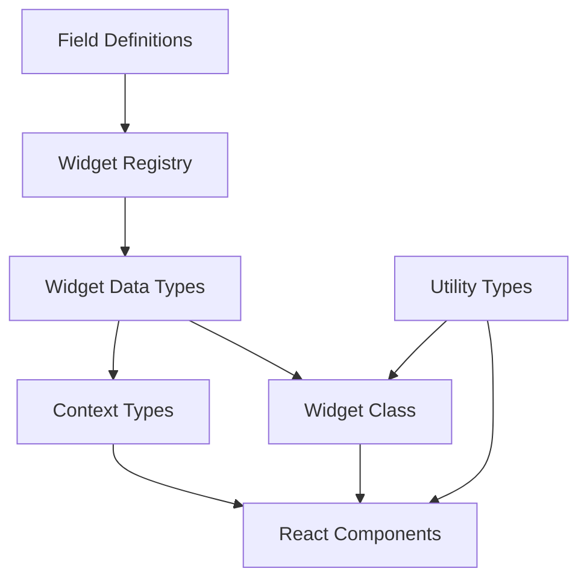
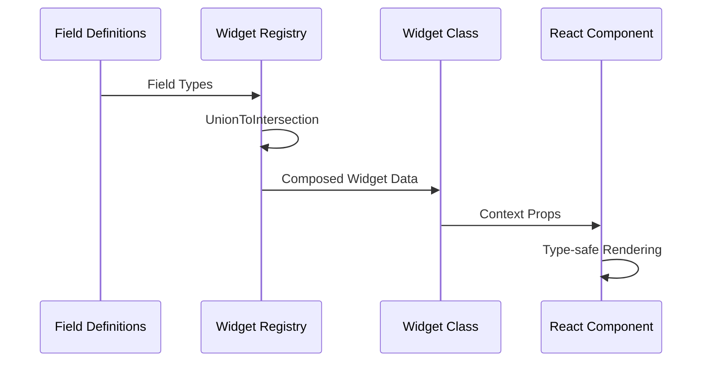
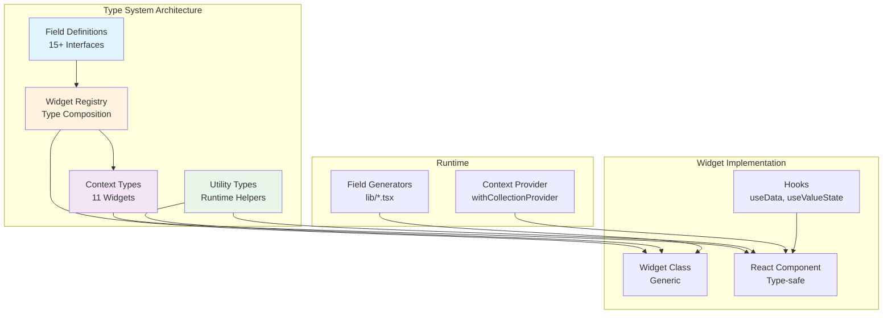

# vis-2 Collection Widgets: Type System Guide

## Contents

- [1. Introduction](#1-introduction)
- [2. Architecture Overview](#2-architecture-overview)
- [3. Field Definitions](#3-field-definitions)
- [4. Widget Registry](#4-widget-registry)
- [5. Context Types](#5-context-types)
- [6. Utility Types and Functions](#6-utility-types-and-functions)
- [7. Widget Implementation](#7-widget-implementation)
- [8. Hooks and State Management](#8-hooks-and-state-management)
- [9. Create a New Widget](#9-create-a-new-widget)
- [10. Extension and Maintenance](#10-extension-and-maintenance)
- [11. Reference](#11-reference)

## 1. Introduction

The type system is the single source of truth for all vis-2 Collection widgets. It automatically composes widget data types from field definitions and exposes them to React components, contexts, and hooks with strict typing. This reduces boilerplate, enforces consistent validation, and provides clear extension paths.

## 2. Architecture Overview

- Single source of truth: all widget data originates from field definitions.
- Type-level composition: the Widget Registry combines fields via union-to-intersection.
- React integration: Generic widget classes and context types secure component contracts.





## 3. Field Definitions

Field definitions describe groups of properties (common, state, delay, …). They are centrally registered and mapped to widgets.

| Field Type   | Interface                | Properties           | Purpose               | Widgets             |
| ------------ | ------------------------ | -------------------- | --------------------- | ------------------- |
| common       | CommonFieldsRxData       | ~35 dynamic          | Icons, header, styles | All                 |
| commonObject | CommonObjectFieldsRxData | 8 static + 3 dynamic | OID, unit, values     | All                 |
| state        | StateFieldsRxData        | 5                    | State handling        | State               |
| delay        | DelayFieldsRxData        | 2                    | Delay/sampling        | State, Switch, etc. |
| slider       | SliderFieldsRxData       | 6                    | Slider configuration  | Slider              |
| switch       | SwitchFieldsRxData       | 4                    | Toggle configuration  | Switch, Light       |
| gauge        | GaugeFieldsRxData        | 7                    | Gauge visualization   | Gauge               |
| dialog       | DialogFieldsRxData       | 5                    | Dialog behavior       | Dialog              |
| select       | SelectFieldsRxData       | 6                    | Selection options     | Select, Radio       |
| checkbox     | CheckboxFieldsRxData     | 4                    | Boolean handling      | Checkbox            |
| template     | TemplateFieldsRxData     | 3                    | Layout templates      | Template            |
| light2       | Light2FieldsRxData       | 8                    | Light profiles        | Light2              |
| buttonGroup  | ButtonGroupFieldsRxData  | 6                    | Multi-action buttons  | ButtonGroup         |
| collection   | CollectionFieldsRxData   | 5                    | Multi-item lists      | Collections         |
| valueState   | ValueStateFieldsRxData   | 4                    | Value + state pairing | Value widgets       |
| range        | RangeFieldsRxData        | 4                    | Min/Max + step        | Slider, Gauge       |
| icon         | IconFieldsRxData         | 3                    | Icon configuration    | Icon widgets        |

Example: field definition and usage in a widget

```typescript
// file:src-widgets/src/types/field-definitions/common.ts
export interface CommonFieldsRxData {
    widgetTitle?: string;
    background?: string;
    icon?: string;
}

// Widget receives all Common fields automatically
class StateCollectionWidget extends Generic<WidgetRegistry['tplStateCollectionWidget']> {
    render() {
        const { widgetTitle, background } = this.props.data;
        return <div style={{ background }}>{widgetTitle}</div>;
    }
}
```

## 4. Widget Registry

The Widget Registry links widgets to their field definitions and produces the final data types.

```typescript
// file:src-widgets/src/types/widget-registry.d.ts
export interface WidgetFieldMappings {
    tplStateCollectionWidget: ['common', 'commonObject', 'state', 'delay'];
    tplSliderCollectionWidget: ['common', 'commonObject', 'slider', 'range'];
    // ... additional widgets
}

type WidgetRegistry = {
    [K in keyof WidgetFieldMappings]: UnionToIntersection<FieldDefinitions[WidgetFieldMappings[K][number]]>;
};
```

Example: StateCollectionWidget derives its data type directly from the registry.

```typescript
class StateCollectionWidget extends Generic<WidgetRegistry['tplStateCollectionWidget']> {
    // data contains Common + CommonObject + State + Delay
}
```

## 5. Context Types

Context types secure communication between widgets and the runtime (socket, theme, project settings).

- CollectionContextProps: base context for all collections
- Widget-specific context types: extend with widget services or selectors
- Usage: HOCs like `withCollectionProvider` inject typed props

```typescript
// file:src-widgets/src/types/context-types.d.ts
export interface CollectionContextProps {
    socket: VisSocket;
    project: VisProjectSettings;
    theme: VisTheme;
}

// In components
type Props = RxRenderWidgetProps<WidgetRegistry['tplSwitchCollectionWidget']> & {
    context: CollectionContextProps;
};
```

## 6. Utility Types and Functions

Utility types connect compile-time knowledge with runtime helpers.

- getDynamicProperty / setDynamicProperty: type-safe dynamic access with guards
- getAllIndexedProperties: build indexed property lists from field definitions
- hasIndexedProperty: check for indexed fields
- Type guards: isValidWidgetData, isValidFieldKey

```typescript
// file:src-widgets/src/types/utility-types.ts
export function getDynamicProperty<T, K extends keyof T>(data: T, key: K): T[K] {
    return data[key];
}

export function setDynamicProperty<T, K extends keyof T>(data: T, key: K, value: T[K]): T {
    return { ...data, [key]: value };
}
```

## 7. Widget Implementation

Widgets extend `Generic<WidgetRegistry['tplWidgetName']>` and use the composed data types.

```typescript
// file:src-widgets/src/StateCollectionWidget/StateCollectionWidget.tsx
class StateCollectionWidget extends Generic<WidgetRegistry['tplStateCollectionWidget']> {
    static getWidgetInfo(): RxWidgetInfo {
        return {
            id: 'tplStateCollectionWidget',
            visSet: 'vis-2-widgets-collection',
            visName: 'StateCollectionWidget',
            visAttrs: [/* field generator output */],
        };
    }

    renderWidget(props: RxRenderWidgetProps<WidgetRegistry['tplStateCollectionWidget']>) {
        const { widgetTitle, oid } = props.data;
        return <StateCollection title={widgetTitle} oid={oid} context={props.context} />;
    }
}
```

- Field generator integration: visAttrs relies on field definitions (e.g., `commonFields()`, `stateFields()`)
- React pattern: renderWidget renders the body; getWidgetInfo registers metadata with vis-2

## 8. Hooks and State Management

Hooks consume the typed data and context.

- useData: returns widget data, synchronized with context
- useValueState: pairs value with ack and timestamp
- useOidValue: binds an OID to state subscriptions

```typescript
// file:src-widgets/src/hooks/useData.ts
export function useData<T>(props: RxRenderWidgetProps<T>): T {
    return props.data;
}

// Example in component
const data = useData<WidgetRegistry['tplSliderCollectionWidget']>(props);
const valueState = useValueState(data.oid, props.context.socket);
```

## 9. Create a New Widget

1. Add field definitions if new fields are required.
2. Extend WidgetFieldMappings with the new widget and its field list.
3. Derive the class from `Generic<WidgetRegistry['tplNewWidget']>`.
4. Populate visAttrs with appropriate field generators.
5. Use hooks for OID/state handling.
6. Run type-safety checks (`tsc --noEmit` or test-d.ts).

> Type composition includes all fields from the configured field types; avoid duplicate names or ambiguous keys.

## 10. Extension and Maintenance

- Add new field definitions: register in `field-definitions` and export in `FieldDefinitions`.
- Preserve type safety: avoid `any`, prefer specific field interfaces.
- Debugging: compiler errors show exact field names; inspect intersection types with Quick Info.
- Common issues: missing registry mapping, typos in field keys, invalid index ranges.

## 11. Reference

- Field Definitions: src-widgets/src/types/field-definitions/index.d.ts
- Registry: src-widgets/src/types/widget-registry.d.ts
- Context: src-widgets/src/types/context-types.d.ts
- Utilities: src-widgets/src/types/utility-types.ts
- Example widget: src-widgets/src/StateCollectionWidget/StateCollectionWidget.tsx
- Field generator: src-widgets/src/lib/commonFields.tsx
- Hooks: src-widgets/src/hooks/useData.ts


