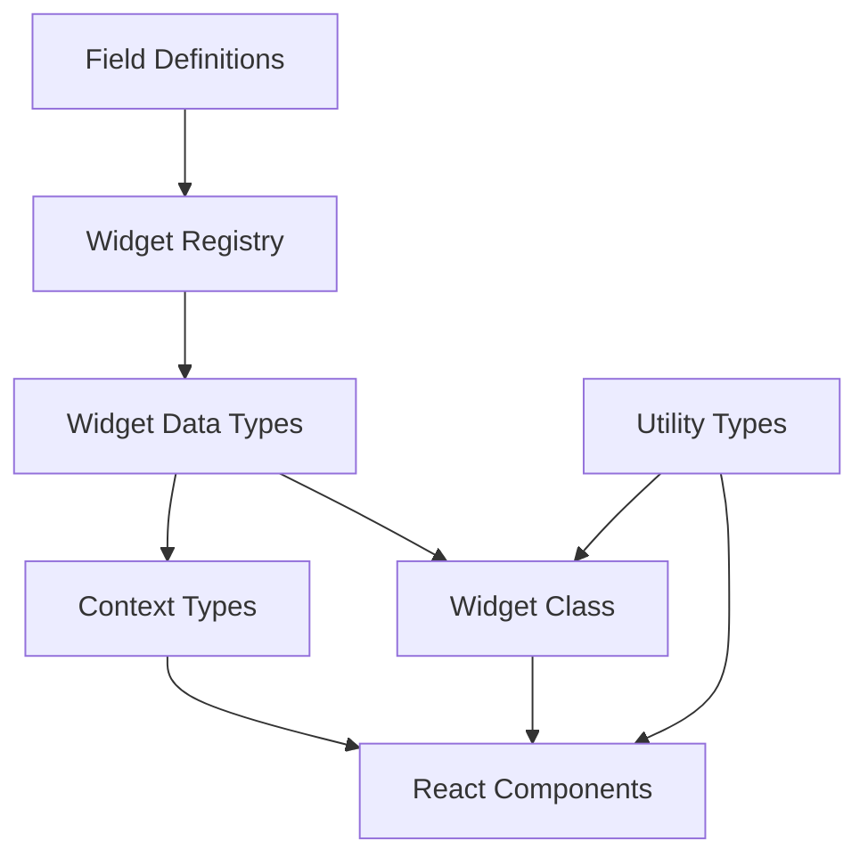
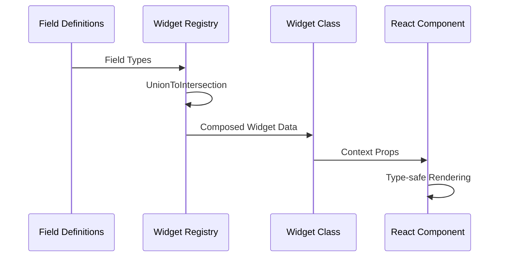
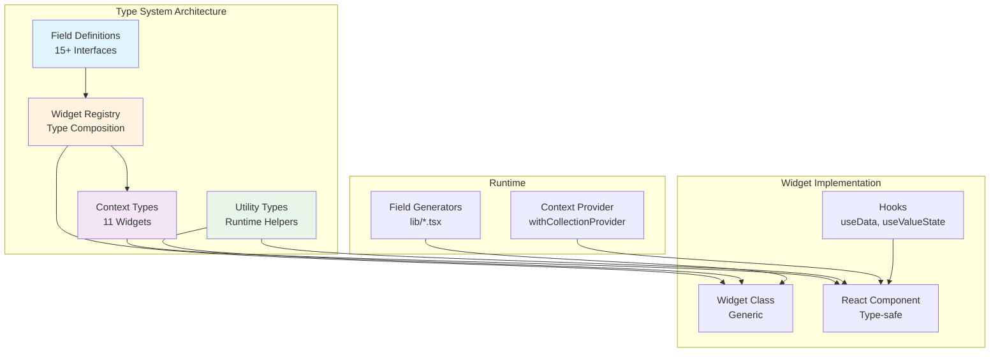

# vis-2 Collection Widgets: Typsystem-Entwicklerhandbuch

## Inhalt

- [1. Einfuehrung](#1-einfuehrung)
- [2. Architektur-Ueberblick](#2-architektur-ueberblick)
- [3. Field Definitions](#3-field-definitions)
- [4. Widget Registry](#4-widget-registry)
- [5. Context Types](#5-context-types)
- [6. Utility Types und Funktionen](#6-utility-types-und-funktionen)
- [7. Widget-Implementierung](#7-widget-implementierung)
- [8. Hooks und State Management](#8-hooks-und-state-management)
- [9. Neues Widget erstellen](#9-neues-widget-erstellen)
- [10. Erweiterung und Wartung](#10-erweiterung-und-wartung)
- [11. Referenz](#11-referenz)

## 1. Einfuehrung

Das Typsystem bildet die Single Source of Truth fuer alle vis-2 Collection Widgets. Es generiert Widget-Datentypen vollautomatisch aus Field Definitions und stellt sie React-Komponenten, Contexts und Hooks strikt typisiert bereit. Entwickler profitieren von weniger Boilerplate, konsistenter Validierung und klaren Erweiterungswegen.

## 2. Architektur-Ueberblick

- Single-Source-of-Truth: Alle Widget-Daten stammen aus Field Definitions.
- Type-Level-Komposition: Widget Registry kombiniert Felder per Union-to-Intersection.
- React-Integration: Generic-Widget-Klassen und Context Types sichern Komponenten ab.





## 3. Field Definitions

Field Definitions beschreiben Eigenschaftsgruppen (common, state, delay, ...). Sie werden zentral registriert und per Mapping Widgets zugeordnet.

| Field Type   | Interface                | Properties               | Verwendung            | Widgets               |
| ------------ | ------------------------ | ------------------------ | --------------------- | --------------------- |
| common       | CommonFieldsRxData       | ~35 dynamisch            | Icons, Header, Styles | Alle                  |
| commonObject | CommonObjectFieldsRxData | 8 statisch + 3 dynamisch | OID, Unit, Values     | Alle                  |
| state        | StateFieldsRxData        | 5                        | State-Handling        | State                 |
| delay        | DelayFieldsRxData        | 2                        | Verzoegerung          | State, Switch, etc.   |
| slider       | SliderFieldsRxData       | 6                        | Slider-Config         | Slider                |
| switch       | SwitchFieldsRxData       | 4                        | Toggle-Config         | Switch, Light         |
| gauge        | GaugeFieldsRxData        | 7                        | Gauge-Visualisierung  | Gauge                 |
| dialog       | DialogFieldsRxData       | 5                        | Dialog-States         | Dialog                |
| select       | SelectFieldsRxData       | 6                        | Auswahlwerte          | Select, Radio         |
| checkbox     | CheckboxFieldsRxData     | 4                        | Boolean-Handling      | Checkbox              |
| template     | TemplateFieldsRxData     | 3                        | Layout-Templates      | Template              |
| light2       | Light2FieldsRxData       | 8                        | Licht-Profile         | Light2                |
| buttonGroup  | ButtonGroupFieldsRxData  | 6                        | Mehrfach-Actions      | ButtonGroup           |
| collection   | CollectionFieldsRxData   | 5                        | Mehrfach-Items        | Collections           |
| valueState   | ValueStateFieldsRxData   | 4                        | Wert + State          | Value-Widgets         |
| range        | RangeFieldsRxData        | 4                        | Min/Max + Step        | Slider, Gauge         |
| icon         | IconFieldsRxData         | 3                        | Icon-Konfiguration    | Icon-basierte Widgets |

Beispiel: Field Definition und Nutzung im Widget

```typescript
// file:src-widgets/src/types/field-definitions/common.ts
export interface CommonFieldsRxData {
    widgetTitle?: string;
    background?: string;
    icon?: string;
}

// Widget erhaelt alle Common-Felder automatisch
class StateCollectionWidget extends Generic<WidgetRegistry['tplStateCollectionWidget']> {
    render() {
        const { widgetTitle, background } = this.props.data;
        return <div style={{ background }}>{widgetTitle}</div>;
    }
}
```

## 4. Widget Registry

Die Widget Registry verknuepft Widgets mit ihren Field Definitions und erzeugt so automatisch die vollstaendigen Datentypen.

```typescript
// file:src-widgets/src/types/widget-registry.d.ts
export interface WidgetFieldMappings {
    tplStateCollectionWidget: ['common', 'commonObject', 'state', 'delay'];
    tplSliderCollectionWidget: ['common', 'commonObject', 'slider', 'range'];
    // ... weitere Widgets
}

type WidgetRegistry = {
    [K in keyof WidgetFieldMappings]: UnionToIntersection<FieldDefinitions[WidgetFieldMappings[K][number]]>;
};
```

Beispiel: StateCollectionWidget bezieht den Datentyp direkt aus der Registry.

```typescript
class StateCollectionWidget extends Generic<WidgetRegistry['tplStateCollectionWidget']> {
    // data enthaelt Common + CommonObject + State + Delay
}
```

## 5. Context Types

Context Types sichern die Kommunikation zwischen Widgets und Runtime (Socket, Theme, Project Settings).

- CollectionContextProps: Basiskontext fuer alle Collections
- Widget-spezifische Context Types: erweitern um widgetbezogene Services oder Selektoren
- Verwendung: HoCs wie `withCollectionProvider` injizieren typisierte Props

```typescript
// file:src-widgets/src/types/context-types.d.ts
export interface CollectionContextProps {
    socket: VisSocket;
    project: VisProjectSettings;
    theme: VisTheme;
}

// In Komponenten
type Props = RxRenderWidgetProps<WidgetRegistry['tplSwitchCollectionWidget']> & {
    context: CollectionContextProps;
};
```

## 6. Utility Types und Funktionen

Utility Types verbinden Typ-Information mit sicheren Laufzeit-Helpern.

- getDynamicProperty / setDynamicProperty: dynamischer Zugriff mit Typ-Guards
- getAllIndexedProperties: generiert indexierte Property-Listen aus Field Definitions
- hasIndexedProperty: prueft auf vorhandene Index-Felder
- Type Guards: isValidWidgetData, isValidFieldKey

```typescript
// file:src-widgets/src/types/utility-types.ts
export function getDynamicProperty<T, K extends keyof T>(data: T, key: K): T[K] {
    return data[key];
}

export function setDynamicProperty<T, K extends keyof T>(data: T, key: K, value: T[K]): T {
    return { ...data, [key]: value };
}
```

## 7. Widget-Implementierung

Widgets erweitern `Generic<WidgetRegistry['tplWidgetName']>` und nutzen die automatisch zusammengesetzten Datentypen.

```typescript
// file:src-widgets/src/StateCollectionWidget/StateCollectionWidget.tsx
class StateCollectionWidget extends Generic<WidgetRegistry['tplStateCollectionWidget']> {
    static getWidgetInfo(): RxWidgetInfo {
        return {
            id: 'tplStateCollectionWidget',
            visSet: 'vis-2-widgets-collection',
            visName: 'StateCollectionWidget',
            visAttrs: [/* Field Generator output */],
        };
    }

    renderWidget(props: RxRenderWidgetProps<WidgetRegistry['tplStateCollectionWidget']>) {
        const { widgetTitle, oid } = props.data;
        return <StateCollection title={widgetTitle} oid={oid} context={props.context} />;
    }
}
```

- Field Generator Integration: visAttrs nutzt die Field Definitions (z. B. `commonFields()`, `stateFields()`)
- React Pattern: renderWidget kapselt die Darstellung, getWidgetInfo meldet die Meta-Daten an vis-2

## 8. Hooks und State Management

Hooks konsumieren die typisierten Daten und Contexts.

- useData: Liefert Widget-Daten, synchronisiert mit Context
- useValueState: Kapselt Wert + Ack + Timestamp
- useOidValue: Bindet OID an State-Abos

```typescript
// file:src-widgets/src/hooks/useData.ts
export function useData<T>(props: RxRenderWidgetProps<T>): T {
    return props.data;
}

// Beispiel in Komponente
const data = useData<WidgetRegistry['tplSliderCollectionWidget']>(props);
const valueState = useValueState(data.oid, props.context.socket);
```

## 9. Neues Widget erstellen

1. Field Definitions ergaenzen, falls neue Felder noetig sind.
2. WidgetFieldMappings um neues Widget + Field-Liste erweitern.
3. Generic-Klasse mit `Generic<WidgetRegistry['tplNeuesWidget']>` ableiten.
4. visAttrs mit passenden Field-Generatoren befuellen.
5. Hooks fuer OID/State-Handling nutzen.
6. Tests fuer Typ-Safety (z. B. `tsc --noEmit` oder test-d.ts) ausfuehren.

> Hinweis: Die Typ-Komposition enthaelt alle Felder der angegebenen Field Types; vermeide doppelte Feldnamen oder uneindeutige Keys.

## 10. Erweiterung und Wartung

- Neue Field Definitions hinzufuegen: In `field-definitions` registrieren und in `FieldDefinitions` exportieren.
- Type-Safety bewahren: Keine `any`-Casts, lieber spezifische Field Interfaces.
- Debugging: Compiler-Fehler zeigen exakte Feldnamen; Intersection-Typen pruefen mit Quick Info.
- Haeufige Fehler: Fehlende Registry-Zuordnung, Tippfehler in Field Keys, unpassende Index-Ranges.

## 11. Referenz

- Field Definitions: file:src-widgets/src/types/field-definitions/index.d.ts
- Registry: file:src-widgets/src/types/widget-registry.d.ts
- Context: file:src-widgets/src/types/context-types.d.ts
- Utilities: file:src-widgets/src/types/utility-types.ts
- Beispiel-Widget: file:src-widgets/src/StateCollectionWidget/StateCollectionWidget.tsx
- Field Generator: file:src-widgets/src/lib/commonFields.tsx
- Hooks: file:src-widgets/src/hooks/useData.ts


