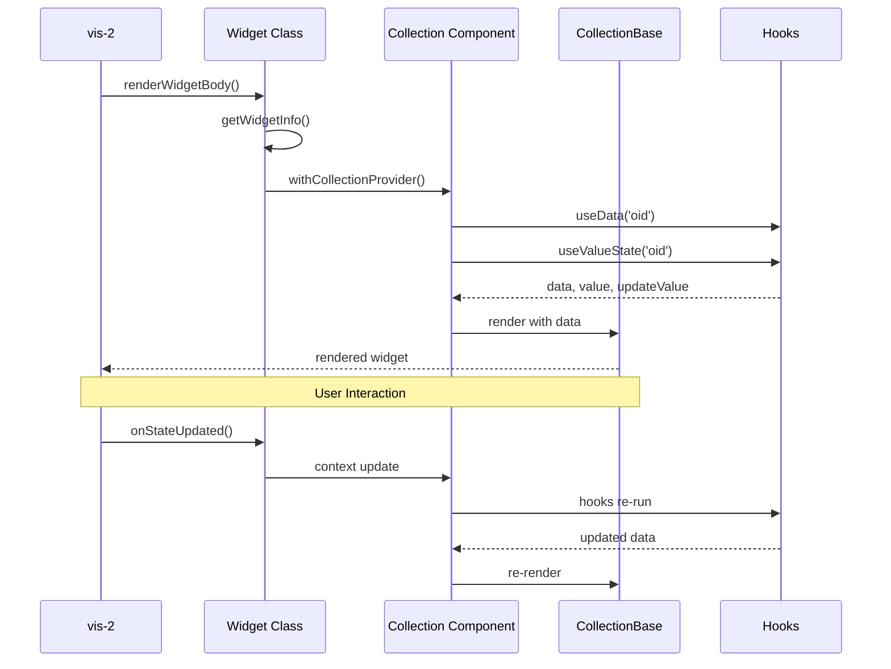

# Implementation Guide: Create a vis-2 Collection Widget

## Contents

1. Introduction
2. Prerequisites
3. Step 1: Widget concept and planning
4. Step 2: Create folder structure
5. Step 3: Create or extend field definitions
6. Step 4: Implement the widget class (`{Name}CollectionWidget.tsx`)
7. Step 5: Implement the React component (`{Name}Collection.tsx`)
8. Step 6: Update the Widget Registry
9. Step 7: Configure Module Federation
10. Step 8: Add internationalization (i18n)
11. Step 9: Provide a preview image
12. Step 10: Test and debug
13. Step 11: Build and deploy
14. Best practices and tips
15. References and resources
16. Widget architecture (Mermaid sequence diagram)
17. Table: widget types and field dependencies
18. Troubleshooting
19. Final review checklist

## 1. Introduction

This guide walks through creating a new Collection widget for ioBroker vis-2. It targets developers who want to build on the existing architecture with practical steps, concrete code examples, and naming conventions. Expect 1–2 hours for a simple widget; more for complex ones.

## 2. Prerequisites

- Working knowledge of TypeScript and React
- Experience with Material UI (MUI)
- Understanding of ioBroker and the vis-2 widget schema
- Tooling: Node.js with npm or yarn
- Project context: Module Federation with Vite, centralized type system under `src-widgets/src/types/`

## 3. Step 1: Widget concept and planning

- Decide the widget value type: boolean, number, string, or mixed.
- Define desired functionality and UI interactions.
- Identify required field definitions (e.g., common, commonObject, state, delay, checkbox, slider).
- Pick a reference widget such as [src-widgets/src/TemplateCollectionWidget/](../../TemplateCollectionWidget/) for a minimal baseline.

## 4. Step 2: Create folder structure

Recommended layout under `src-widgets/src/`:

```
src-widgets/src/
└── MyNewCollectionWidget/
    ├── MyNewCollectionWidget.tsx   # Widget class definition
    └── MyNewCollection.tsx         # React component (UI)
```

Naming conventions:

- Folder: `{Name}CollectionWidget`
- Widget class: `{Name}CollectionWidget.tsx`
- React component: `{Name}Collection.tsx`

## 5. Step 3: Create or extend field definitions

Add new field definitions only when existing ones do not cover your use case.

- Location (runtime generators): `src-widgets/src/lib/`
- Types: `src-widgets/src/types/field-definitions/`
- Registry entry: re-export in the FieldDefinitions registry
- Example: [src-widgets/src/lib/checkboxFields.tsx](../../lib/checkboxFields.tsx)

## 6. Step 4: Implement the widget class (`{Name}CollectionWidget.tsx`)

Baseline structure:

```typescript
import React from 'react';
import type { WidgetRegistry } from '../types';
import Generic from '../Generic';
import withCollectionProvider from '../components/withCollectionProvider';
import commonFields from '../lib/commonFields';
import commonObjectFields from '../lib/commonObjectFields';
import delayFields from '../lib/delayFields';
// add more field imports as needed

class MyNewCollectionWidget extends Generic<WidgetRegistry['tplMyNewCollectionWidget']> {
    static getWidgetInfo() {
        return {
            id: 'tplMyNewCollectionWidget',
            visSet: 'vis-2-widgets-collection',
            visSetLabel: 'widgets_collection',
            visSetColor: '#0C0A43',
            visName: 'MyNewCollectionWidget',
            visWidgetLabel: 'my_new_collection_widget',
            visOrder: 3,
            visAttrs: [
                { name: 'common', fields: [...commonFields()] },
                {
                    name: 'my_new',
                    label: 'group_my_new',
                    fields: [
                        ...commonObjectFields(['string', 'number', 'boolean', 'mixed']),
                        ...delayFields(),
                        // add additional field groups here
                    ],
                },
            ],
            visDefaultStyle: {
                width: 200,
                height: 100,
            },
            visPrev: 'widgets/vis-2-widgets-collection/img/prev-collection-mynew.png',
        };
    }

    componentDidMount() {
        // optional subscriptions or initialization
    }

    onRxDataChanged() {
        // react to editor data changes
    }

    onRxStyleChanged() {
        // react to style changes
    }

    onStateUpdated(id, state) {
        // react to state updates from the socket
    }

    renderWidgetBody(props) {
        const Component = withCollectionProvider(MyNewCollection);
        return <Component {...props} />;
    }
}

export default withCollectionProvider(MyNewCollectionWidget);
```

Reference: [src-widgets/src/CheckboxCollectionWidget/CheckboxCollectionWidget.tsx](../../CheckboxCollectionWidget/CheckboxCollectionWidget.tsx)

## 7. Step 5: Implement the React component (`{Name}Collection.tsx`)

Example structure:

```typescript
import { useContext } from 'react';
import { CollectionContext } from '../components/CollectionProvider';
import CollectionBase from '../components/CollectionBase';
import useData from '../hooks/useData';
import useValueState from '../hooks/useValueState';

function MyNewCollection(): React.JSX.Element {
    const context = useContext(CollectionContext);
    const { widget } = context;
    const { data } = useData('oid');
    const { value, updateValue } = useValueState('oid');

    return (
        <CollectionBase data={data} oidValue={value}>
            {/* Implement widget-specific UI here */}
            <button onClick={() => updateValue(value)}>Update</button>
        </CollectionBase>
    );
}

export default MyNewCollection;
```

Key hooks:

- `useData('oid')`: returns attribute and style data.
- `useValueState('oid')`: returns current OID value plus an update function.
- `useOidValue('oid')`: returns only the current value.
- `useStyles(widget.style)`: processes styles.

Reference: [src-widgets/src/CheckboxCollectionWidget/CheckboxCollection.tsx](../../CheckboxCollectionWidget/CheckboxCollection.tsx)

## 8. Step 6: Update the Widget Registry

The registry links widget IDs to field groups and enforces type safety. Update `src-widgets/src/types/widget-registry.d.ts`:

```typescript
interface WidgetFieldMappings {
    // existing widgets ...
    tplMyNewCollectionWidget: ['common', 'commonObject', 'myNewFields', 'delay'];
}
```

This generates the correct field intersection for `WidgetRegistry['tplMyNewCollectionWidget']` used by the Generic base class.

## 9. Step 7: Configure Module Federation

Expose the widget in `src-widgets/vite.config.ts`:

```typescript
exposes: {
    // existing widgets ...
    './MyNewCollectionWidget': './src/MyNewCollectionWidget/MyNewCollectionWidget',
}
```

## 10. Step 8: Add internationalization (i18n)

Add keys to `src-widgets/src/i18n/de.json` and `src-widgets/src/i18n/en.json` (plus more languages if needed):

```json
{
    "my_new_collection_widget": "My new widget",
    "group_my_new": "My widget",
    "my_new_field_label": "Field label"
}
```

## 11. Step 9: Provide a preview image

- Path: `widgets/vis-2-widgets-collection/img/prev-collection-{name}.png`
- Size: roughly 200x150 px, PNG with transparency
- Content: typical widget view (e.g., default layout)

## 12. Step 10: Test and debug

Start the dev server:

```bash
cd src-widgets
npm run dev
```

Checklist:

- Widget appears in the palette.
- Attribute configuration works.
- OID binding works (read/write).
- Value updates display correctly.
- Styles apply correctly.
- Responsive behavior verified.
- Light/Dark theme verified.

Common issues:

- Typo in Widget Registry mapping.
- Missing collection provider.
- OID object undefined or incorrect type.
- Styling conflicts or missing CSS variables.

## 13. Step 11: Build and deploy

Production build:

```bash
cd src-widgets
npm run build
```

Verify:

- Build completes without errors.
- `build/customWidgets.js` is generated.
- Module Federation manifest exists (`build/mf-manifest.json`).
- Widget is available in vis-2 (refresh palette or restart adapter).

## 14. Best practices and tips

Code quality:

- Keep TypeScript in strict mode; avoid `any`.
- Follow ESLint rules.
- Document classes and components briefly.

Performance:

- Use `useMemo` for expensive calculations.
- Use `useCallback` for event handlers.
- Avoid unnecessary re-renders (watch props and context).

Maintainability:

- Consistent naming for folders, classes, and i18n keys.
- Reuse components (CollectionBase, hooks).
- Lean on the type system instead of runtime checks.

## 15. References and resources

Example widgets:

- Simple: [src-widgets/src/TemplateCollectionWidget/](../../TemplateCollectionWidget/)
- Medium: [src-widgets/src/CheckboxCollectionWidget/](../../CheckboxCollectionWidget/)
- Complex: [src-widgets/src/Light2CollectionWidget/](../../Light2CollectionWidget/)

Documentation:

- Type system: [src-widgets/src/types/docs/README.md](./README.md)
- Migration: [src-widgets/src/types/docs/MIGRATION-GUIDE.md](./MIGRATION-GUIDE.md)
- vis-2 widget schema (GitHub): https://github.com/ioBroker/ioBroker.vis-2-widgets-react-dev

Core components:

- Base class: [src-widgets/src/Generic.tsx](../../Generic.tsx)
- UI wrapper: [src-widgets/src/components/CollectionBase.tsx](../../components/CollectionBase.tsx)
- Context: [src-widgets/src/components/CollectionProvider.tsx](../../components/CollectionProvider.tsx)

## 16. Widget architecture (Mermaid sequence diagram)



## 17. Table: widget types and field dependencies

| Widget type | Allowed OID types              | Required field groups                 | Complexity   |
| ----------- | ------------------------------ | ------------------------------------- | ------------ |
| Template    | boolean                        | common, commonObject                  | Easy         |
| State       | boolean, number, string, mixed | common, commonObject, state, delay    | Easy         |
| Checkbox    | boolean                        | common, commonObject, checkbox, delay | Easy         |
| Switch      | boolean                        | common, commonObject, switch, delay   | Medium       |
| Slider      | number                         | common, commonObject, slider, delay   | Medium       |
| Gauge       | number                         | common, commonObject, gauge           | Complex      |
| Light2      | mixed                          | common, commonObject, light2, delay   | Very complex |

## 18. Troubleshooting

Issue: Widget does not appear in palette

- Check Module Federation configuration.
- Rebuild and reload the adapter/vis-2.

Issue: Type error in WidgetRegistry

- Verify the field mapping in `widget-registry.d.ts`.
- Confirm field definitions are exported correctly.

Issue: Context is undefined

- Confirm `withCollectionProvider` wraps the widget.
- Ensure `CollectionContext` is imported correctly.

## 19. Final review checklist

- Verify completeness (fields, registry, i18n, exposes, preview image).
- Compare code examples against reference widgets.
- Validate links.
- Check spelling and formatting.
- Preview Mermaid diagrams in Markdown.
