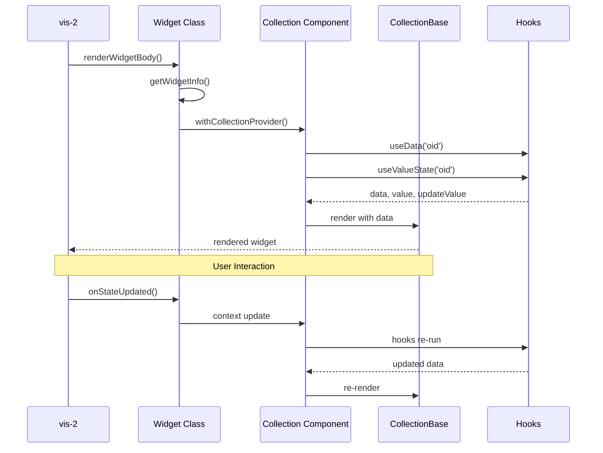

# Implementierungs-Guide: Neues vis-2 Collection-Widget erstellen

## Inhalt

1. Einleitung
2. Voraussetzungen
3. Schritt 1: Widget-Konzept und Planung
4. Schritt 2: Verzeichnisstruktur erstellen
5. Schritt 3: Field-Definitionen erstellen oder erweitern
6. Schritt 4: Widget-Klasse implementieren (`{Name}CollectionWidget.tsx`)
7. Schritt 5: React-Komponente implementieren (`{Name}Collection.tsx`)
8. Schritt 6: Widget Registry aktualisieren
9. Schritt 7: Module Federation konfigurieren
10. Schritt 8: Internationalisierung (i18n) hinzufuegen
11. Schritt 9: Vorschaubild erstellen
12. Schritt 10: Testen und Debuggen
13. Schritt 11: Build und Deployment
14. Best Practices und Tipps
15. Referenzen und Ressourcen
16. Widget-Architektur (Mermaid Sequenzdiagramm)
17. Tabelle: Widget-Typen und Field-Dependencies
18. Troubleshooting
19. Finalisierung und Review

## 1. Einleitung

Dieser Guide fuehrt Schritt fuer Schritt durch die Erstellung eines neuen Collection-Widgets fuer ioBroker vis-2. Zielgruppe sind Entwicklerinnen und Entwickler, die ein neues Widget auf Basis der bestehenden Architektur bereitstellen moechten. Der Fokus liegt auf einer praktischen Anleitung mit konkreten Code-Beispielen, klaren Namenskonventionen und Hinweisen zu Best Practices. Fuer ein einfaches Widget ist mit ca. 1–2 Stunden Aufwand zu rechnen, fuer komplexere Widgets entsprechend mehr.

## 2. Voraussetzungen

- Grundkenntnisse in TypeScript und React
- Erfahrung mit Material-UI (MUI)
- Verstaendnis des ioBroker-Systems und des vis-2 Widget-Schemas
- Entwicklungsumgebung: Node.js, npm oder yarn
- Projektkontext: Module Federation mit Vite, zentrales Typsystem unter `src-widgets/src/types/`

## 3. Schritt 1: Widget-Konzept und Planung

- Bestimme den Widget-Typ: boolean, number, string oder mixed.
- Definiere die gewuenschte Funktionalitaet und UI-Interaktionen.
- Identifiziere benoetigte Field-Definitionen (z. B. common, commonObject, state, delay, checkbox, slider).
- Waehle ein Referenz-Widget als Vorlage, z. B. [src-widgets/src/TemplateCollectionWidget/](../../TemplateCollectionWidget/) fuer ein minimales Beispiel.

## 4. Schritt 2: Verzeichnisstruktur erstellen

Empfohlene Struktur innerhalb von `src-widgets/src/`:

```
src-widgets/src/
└── MyNewCollectionWidget/
    ├── MyNewCollectionWidget.tsx   # Widget-Definition (Klasse)
    └── MyNewCollection.tsx         # React-Komponente (UI)
```

Namenskonventionen:

- Ordner: `{Name}CollectionWidget`
- Widget-Klasse: `{Name}CollectionWidget.tsx`
- React-Komponente: `{Name}Collection.tsx`

## 5. Schritt 3: Field-Definitionen erstellen oder erweitern

Neue Field-Definitionen sind nur noetig, wenn bestehende Felder den Bedarf nicht abdecken.

- Ort: `src-widgets/src/lib/`
- Typen: `src-widgets/src/types/field-definitions/`
- Registry-Eintrag: Sammel-Export in der FieldDefinitions-Registry
- Beispiel: [src-widgets/src/lib/checkboxFields.tsx](../../lib/checkboxFields.tsx)

## 6. Schritt 4: Widget-Klasse implementieren (`{Name}CollectionWidget.tsx`)

Grundstruktur (vereinfacht):

```typescript
import React from 'react';
import type { WidgetRegistry } from '../types';
import Generic from '../Generic';
import withCollectionProvider from '../components/withCollectionProvider';
import commonFields from '../lib/commonFields';
import commonObjectFields from '../lib/commonObjectFields';
import delayFields from '../lib/delayFields';
// weitere Field-Imports nach Bedarf

class MyNewCollectionWidget extends Generic<WidgetRegistry['tplMyNewCollectionWidget']> {
    static getWidgetInfo() {
        return {
            id: 'tplMyNewCollectionWidget',
            visSet: 'vis-2-widgets-collection',
            visSetLabel: 'widgets_collection',
            visSetColor: '#0C0A43',
            visName: 'MyNewCollectionWidget',
            visWidgetLabel: 'my_new_collection_widget',
            visOrder: 3,
            visAttrs: [
                { name: 'common', fields: [...commonFields()] },
                {
                    name: 'my_new',
                    label: 'group_my_new',
                    fields: [
                        ...commonObjectFields(['string', 'number', 'boolean', 'mixed']),
                        ...delayFields(),
                        // weitere Fields hier
                    ],
                },
            ],
            visDefaultStyle: {
                width: 200,
                height: 100,
            },
            visPrev: 'widgets/vis-2-widgets-collection/img/prev-collection-mynew.png',
        };
    }

    componentDidMount() {
        // optionale Subscriptions oder Initialisierungen
    }

    onRxDataChanged() {
        // reagiere auf Daten-Aenderungen (Editor-Werte)
    }

    onRxStyleChanged() {
        // reagiere auf Style-Aenderungen
    }

    onStateUpdated(id, state) {
        // reagiere auf State-Updates vom Socket
    }

    renderWidgetBody(props) {
        const Component = withCollectionProvider(MyNewCollection);
        return <Component {...props} />;
    }
}

export default withCollectionProvider(MyNewCollectionWidget);
```

Referenz: [src-widgets/src/CheckboxCollectionWidget/CheckboxCollectionWidget.tsx](../../CheckboxCollectionWidget/CheckboxCollectionWidget.tsx)

## 7. Schritt 5: React-Komponente implementieren (`{Name}Collection.tsx`)

Beispielstruktur:

```typescript
import { useContext } from 'react';
import { CollectionContext } from '../components/CollectionProvider';
import CollectionBase from '../components/CollectionBase';
import useData from '../hooks/useData';
import useValueState from '../hooks/useValueState';

function MyNewCollection(): React.JSX.Element {
    const context = useContext(CollectionContext);
    const { widget } = context;
    const { data } = useData('oid');
    const { value, updateValue } = useValueState('oid');

    return (
        <CollectionBase data={data} oidValue={value}>
            {/* Widget-spezifische UI hier implementieren */}
            <button onClick={() => updateValue(value)}>Update</button>
        </CollectionBase>
    );
}

export default MyNewCollection;
```

Wichtige Hooks:

- `useData('oid')`: Liefert Daten aus Attributen und Styles.
- `useValueState('oid')`: Liefert aktuellen OID-Wert plus Update-Funktion.
- `useOidValue('oid')`: Liefert nur den aktuellen Wert.
- `useStyles(widget.style)`: Verarbeitet Styles.

Referenz: [src-widgets/src/CheckboxCollectionWidget/CheckboxCollection.tsx](../../CheckboxCollectionWidget/CheckboxCollection.tsx)

## 8. Schritt 6: Widget Registry aktualisieren

Die Registry verknuepft Widget-IDs mit Field-Gruppen und stellt Typsicherheit bereit. Anpassung in `src-widgets/src/types/widget-registry.d.ts`:

```typescript
interface WidgetFieldMappings {
    // bestehende Widgets ...
    tplMyNewCollectionWidget: ['common', 'commonObject', 'myNewFields', 'delay'];
}
```

Dadurch werden die richtigen Feld-Typen fuer `WidgetRegistry['tplMyNewCollectionWidget']` generiert und vom `Generic`-Basistyp genutzt.

## 9. Schritt 7: Module Federation konfigurieren

Expose in `src-widgets/vite.config.ts` ergaenzen:

```typescript
exposes: {
    // bestehende Widgets ...
    './MyNewCollectionWidget': './src/MyNewCollectionWidget/MyNewCollectionWidget',
}
```

## 10. Schritt 8: Internationalisierung (i18n) hinzufuegen

Keys in `src-widgets/src/i18n/de.json` und `src-widgets/src/i18n/en.json` ergaenzen (weitere Sprachen nach Bedarf):

```json
{
    "my_new_collection_widget": "Mein neues Widget",
    "group_my_new": "Mein Widget",
    "my_new_field_label": "Feldbezeichnung"
}
```

## 11. Schritt 9: Vorschaubild erstellen

- Pfad: `widgets/vis-2-widgets-collection/img/prev-collection-{name}.png`
- Groesse: ca. 200x150 px, PNG mit Transparenz
- Motiv: typische Widget-Darstellung (z. B. Default-Layout)

## 12. Schritt 10: Testen und Debuggen

Entwicklungsserver starten:

```bash
cd src-widgets
npm run dev
```

Checkliste:

- Widget erscheint in der Palette.
- Attribut-Konfiguration funktioniert.
- OID-Binding funktioniert (Lesen/Schreiben).
- Wert-Updates werden angezeigt.
- Styles werden korrekt angewendet.
- Responsives Verhalten pruefen.
- Dark/Light Theme pruefen.

Haeufige Probleme:

- Typfehler in Widget Registry.
- Fehlender Context-Provider.
- OID-Objekt undefined oder falscher Typ.
- Styling-Konflikte oder fehlende CSS-Variablen.

## 13. Schritt 11: Build und Deployment

Production-Build:

```bash
cd src-widgets
npm run build
```

Pruefen:

- Build ohne Fehler abgeschlossen.
- `build/customWidgets.js` erzeugt.
- Module Federation Manifest vorhanden (`build/mf-manifest.json`).
- Widget in vis-2 verfuegbar (Palette aktualisieren oder Adapter neu starten).

## 14. Best Practices und Tipps

Code-Qualitaet:

- TypeScript strict mode einhalten, keine `any`-Typen.
- ESLint-Regeln beachten.
- Komponenten und Klassen kurz dokumentieren.

Performance:

- `useMemo` fuer teure Berechnungen.
- `useCallback` fuer Event-Handler.
- Unnoetige Re-Renders vermeiden (Props und Context beachten).

Wartbarkeit:

- Konsistente Namensgebung fuer Ordner, Klassen und i18n-Keys.
- Wiederverwendbare Komponenten nutzen (CollectionBase, Hooks).
- Type-Safety ausschopfend verwenden.

## 15. Referenzen und Ressourcen

Beispiel-Widgets:

- Einfach: [src-widgets/src/TemplateCollectionWidget/](../../TemplateCollectionWidget/)
- Mittel: [src-widgets/src/CheckboxCollectionWidget/](../../CheckboxCollectionWidget/)
- Komplex: [src-widgets/src/Light2CollectionWidget/](../../Light2CollectionWidget/)

Dokumentation:

- Type-System: [src-widgets/src/types/docs/README.md](./README.md)
- Migration: [src-widgets/src/types/docs/MIGRATION-GUIDE.md](./MIGRATION-GUIDE.md)
- vis-2 Widget Schema (GitHub): https://github.com/ioBroker/ioBroker.vis-2-widgets-react-dev

Kern-Komponenten:

- Basis-Klasse: [src-widgets/src/Generic.tsx](../../Generic.tsx)
- UI-Wrapper: [src-widgets/src/components/CollectionBase.tsx](../../components/CollectionBase.tsx)
- Context: [src-widgets/src/components/CollectionProvider.tsx](../../components/CollectionProvider.tsx)

## 16. Widget-Architektur (Mermaid Sequenzdiagramm)



## 17. Tabelle: Widget-Typen und Field-Dependencies

| Widget-Typ | Erlaubte OID-Typen             | Benoetigte Fields                     | Komplexitaet |
| ---------- | ------------------------------ | ------------------------------------- | ------------ |
| Template   | boolean                        | common, commonObject                  | Einfach      |
| State      | boolean, number, string, mixed | common, commonObject, state, delay    | Einfach      |
| Checkbox   | boolean                        | common, commonObject, checkbox, delay | Einfach      |
| Switch     | boolean                        | common, commonObject, switch, delay   | Mittel       |
| Slider     | number                         | common, commonObject, slider, delay   | Mittel       |
| Gauge      | number                         | common, commonObject, gauge           | Komplex      |
| Light2     | mixed                          | common, commonObject, light2, delay   | Sehr komplex |

## 18. Troubleshooting

Problem: Widget erscheint nicht in Palette

- Loesung: Module Federation Konfiguration pruefen.
- Loesung: Build neu durchfuehren und Adapter/vis-2 neu laden.

Problem: Typ-Fehler bei WidgetRegistry

- Loesung: Field-Mapping in `widget-registry.d.ts` pruefen.
- Loesung: Field-Definitionen korrekt exportiert?

Problem: Context ist undefined

- Loesung: `withCollectionProvider` korrekt verwendet?
- Loesung: `CollectionContext` korrekt importiert?

## 19. Finalisierung und Review

- Vollstaendigkeit pruefen (Fields, Registry, i18n, Exposes, Preview-Bild).
- Code-Beispiele gegen Referenz-Widgets halten.
- Links verifizieren.
- Rechtschreibung und Formatierung pruefen.
- Mermaid-Diagramm in Markdown-Preview validieren.
